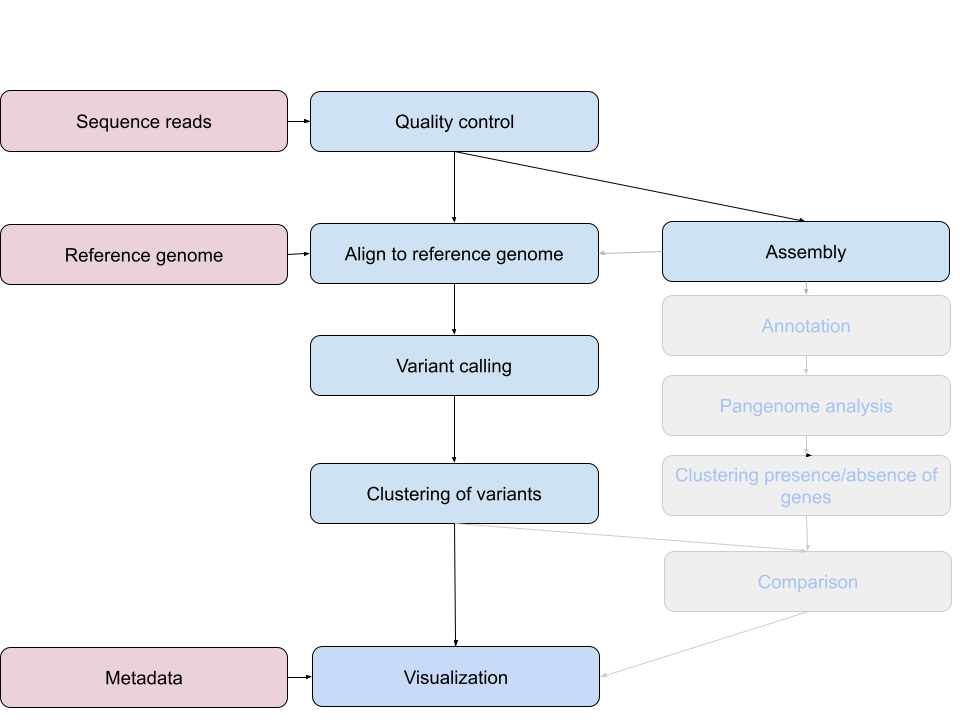

The low mutation rate of *M. tuberculosis* means that even at the highest resolution provided by whole genome sequencing it is still difficult to confidently affirm the inferences of transmission made by traditional epidemiological techniques. This means it is very difficult to determine transmission inclusively. However, whole genome sequencing does in some cases allow us to exclude direct transmission, by using the phylogenetic context provided by other strains. Not only does whole genome sequencing provide the inter-cluster differentiation provided by current typing methods, but it also achieves intra-cluster resolution which can be used to inform epidemiological investigation.

::::::::::::::::::::::::::::::::::::::: objectives

- Explore the resulting trees in conjunction with the meta data.
- Make an estimation on the likelihood of transmission events
- Compare and interpret the different data sources.

::::::::::::::::::::::::::::::::::::::::::::::::::

:::::::::::::::::::::::::::::::::::::::: questions

- How are phylogenetic trees viewed and compared?
- How can I visualize several layers of data?
- In which cases is transmission likely?

::::::::::::::::::::::::::::::::::::::::::::::::::

## Comparison of clustering results

We grouped (clustered) our isolates by the information that we extracted from the sequencing reads. We compared our isolates to a reference genome and clustered them on basis of the single nucleotide variations that they exhibit when compared to this reference.

{alt='workflow'}

Next, we will visualize this clustering in the context of the meta data. Make sure you have the SNP tree that you generated (or can be downloaded here [core.aln.newick](files/core.aln.newick)) on your own computer. Download also the [metadata file](files/Molepi_meta.csv).

## Visualization of genetic information and metadata

Visualization is frequently used to aid the interpretation of complex datasets. Within microbial genomics, visualizing the relationships between multiple genomes as a tree provides a framework onto which associated data (geographical, temporal, phenotypic and epidemiological) are added to generate hypotheses and to explore the dynamics of the system under investigation.

1. Open Chrome. Go to [microreact](https://microreact.org/). 
2. Click on 'Upload'. Drag-and-drop the newick tree produced by snippy and IQ-TREE ([core.aln.newick](files/core.aln.newick)). 
3. Click on "Add more files" and select the the [metadata file](files/Molepi_meta.csv), which is a table comprising metadata file. Choose 'Data (csv or tsv)' as file kind.
4. Click on continue. 

First, the tree should be rooted with the reference strain (the one that has the longest branch). Hover over the middle of the long branch, until a circle appears. Right-click on it, and select "Set as root (re-root)". 

Explore the location, time and further meta data. Play around with the different visualization options with the help of the [documentation of microreact](https://docs.microreact.org/).

::::::::::::::::::::::::::::::::::::::  discussion

## Discussion

1. Which transmission events are likely based on the metadata (location, RFLP, date) alone?
2. Which transmission events are likely based on the SNP data?
3. Draw a transmission tree if possible.
  

::::::::::::::::::::::::::::::::::::::::::::::::::

## Discussion

Compare the pangenome clustering with the clustering based on SNPs and with the data from
epidemiological contact tracing:

Cluster A

- Patient A1 - sample ERR029207
- Patient A2 - sample ERR029206
- Patient A3 - sample ERR026478

Cluster B

- Patient B1 - sample ERR026474
- Patient B2 - sample ERR026473

Cluster C

- Patient C1 - sample ERR026481
- Patient C2 - sample ERR026482

Which transmission events are affirmed by the genomic data? Which ones partially or not? Why?

:::::::::::::::::::::::::::::::::::::::: keypoints

- SNP phylogeny and metadata can convey different messages
- Human interpretation is often needed to weigh the different information sources.
- The low mutation rate of *M. tuberculosis* does not allow to make confident inferences of transmission but does allow to exclude transmission

::::::::::::::::::::::::::::::::::::::::::::::::::

