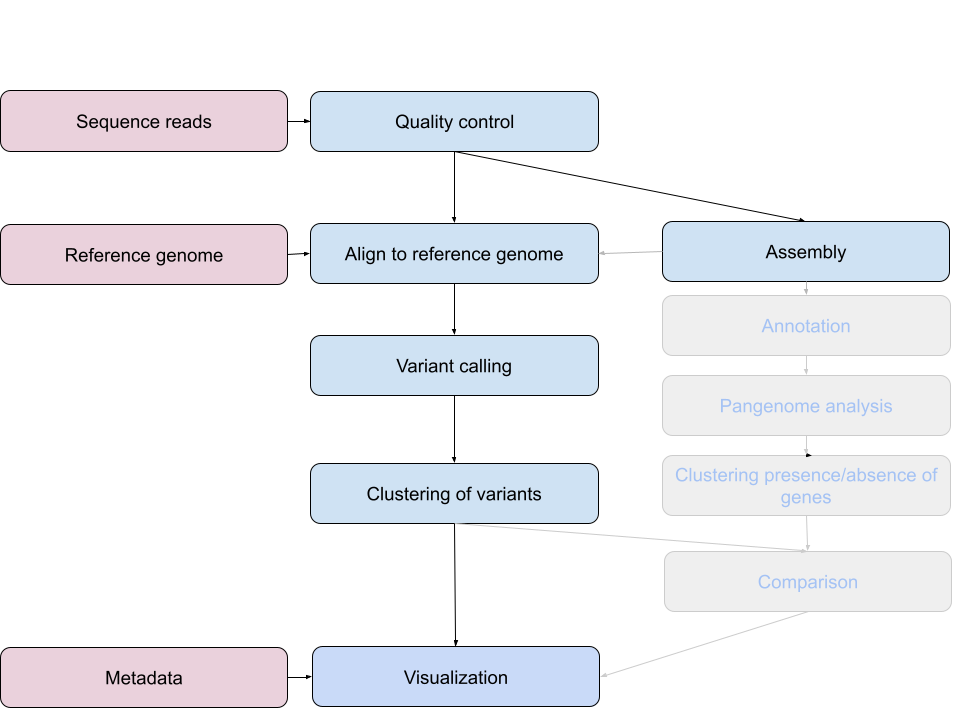
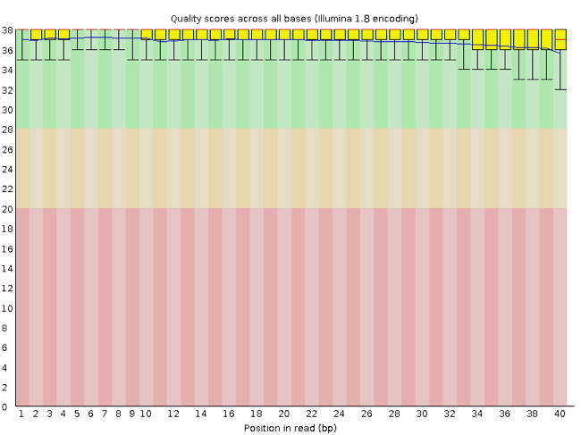

Let's check if the downloads finished. Let's have a look at the files.

::::::::::::::::::::::::::::::::::::::: objectives

- Interpret a FastQC plot summarizing per-base quality across all reads.
- Clean FastQC reads for further analysis.
- Use `for` loops to automate operations on multiple files.

::::::::::::::::::::::::::::::::::::::::::::::::::

:::::::::::::::::::::::::::::::::::::::: questions

- How can I describe the quality of my data?
- How can I get rid of sequence data that doesn't meet my quality standards?

::::::::::::::::::::::::::::::::::::::::::::::::::

```source
$ ls
```

```output
ERR029206_1.fastq.gz
ERR029206_2.fastq.gz 
```

All new files start with ERR and have a `fastq.gz` extension. It means they are in fastq format and compressed. Let's make a copy of one file and uncompress this file to inspect it further

```bash
cp ERR029206_1.fastq.gz ERR029206_1.copy.fastq.gz
gunzip ERR029206_1.copy.fastq.gz
```

## Bioinformatics workflows

When working with high-throughput sequencing data, the raw reads you get off of the sequencer will need to pass through a number of  different tools in order to generate your final desired output. The execution of this set of tools in a specified order is commonly referred to as a *workflow* or a *pipeline*.

An example of the workflow we will be using is provided below with a brief
description of each step.

{alt='Schematic workflow of the bioinformatics workflow'}

1. Quality control - Assessing quality using FastQC
2. Quality control - Trimming and/or filtering reads (if necessary)
3. Align reads to reference genome - Snippy
4. Variant calling - Snippy
5. Clustering variants - iTOL
6. Assembly - SKESA
7. Annotation (extra material)
8. Pangenome analysis (extra material)
9. Clustering presence and absence of genes (extra material)
10. Comparison of clustering methods (extra material)
11. Data visualization - Microreact

These workflows in bioinformatics adopt a plug-and-play approach in that the output of one tool can be easily used as input to another tool without any extensive configuration. Having standards for data formats is what makes this feasible. Standards ensure that data is stored in a way that is generally accepted and agreed upon within the community. The tools that are used to analyze data at different stages of the workflow are therefore built under the assumption that the data will be provided in a specific format.

## Quality Control

The first step in the variant calling workflow is to take the FASTQ files received from the sequencing facility
and assess the quality of the sequence reads.

{alt='Quality control workflow'}

You've already seen that part, but repetition doesn't hurt. If you feel that it's anyway unnecessary, move on to the next part.

### Details on the FASTQ format

Although it looks complicated (and it is), it's easy to understand the
[fastq](https://en.wikipedia.org/wiki/FASTQ_format) format with a little decoding. Some rules about the format include...

| Line   | Description                                                                                                  | 
| ------ | ------------------------------------------------------------------------------------------------------------ |
| 1      | Always begins with '@' and then information about the read                                                   | 
| 2      | The actual DNA sequence                                                                                      | 
| 3      | Always begins with a '+' and sometimes the same info in line 1                                               | 
| 4      | Has a string of characters which represent the quality scores; must have same number of characters as line 2 | 

We can view the first complete read in one of the files our dataset by using `head` to look at the first four lines.

```bash
$ head -n4 ERR029206_1.copy.fastq
```

```output
@ERR029206.1 IL31_5505:8:1:6233:1087#4/1
TCNAGTCAGCACACACATGCGAAAGAATCCACCGACTAGGGTCAGCGGGGTTTGCAGTTGGTCGCGGACGTAACCG
+
<='=ABBBBCBBBBBBBBC>BBCBBBBBB@BBBBBB=BCBB@@B@@BB@@,@@@@@@@@@@@@@@@@@@@@@@@@@
```

One of the nucleotides in this read is unknown (`N`).

Line 4 shows the quality for each nucleotide in the read. Quality is interpreted as the probability of an incorrect base call (e.g. 1 in 10) or, equivalently, the base call accuracy (eg 90%). To make it possible to line up each individual nucleotide with its quality score, the numerical score is converted into a code where each individual character represents the numerical quality score for an individual nucleotide. For example, in the line above, the quality score line is:

```output
<='=ABBBBCBBBBBBBBC>BBCBBBBBB@BBBBBB=BCBB@@B@@BB@@,@@@@@@@@@@@@@@@@@@@@@@@@@
```

The `<` character and each of the `=` characters represent the encoded quality for an individual nucleotide. The numerical value assigned to each of these characters depends on the sequencing platform that generated the reads. The sequencing machine used to generate our data uses the standard Sanger quality PHRED score encoding, using by Illumina version 1.8 onwards. Each character is assigned a quality score between 0 and 40 as shown in the chart below.

```output
Quality encoding: !"#$%&'()*+,-./0123456789:;<=>?@ABCDEFGHI
                  |         |         |         |         |
Quality score:    0........10........20........30........40                                
```

Each quality score represents the probability that the corresponding nucleotide call is incorrect. This quality score is logarithmically based, so a quality score of 10 reflects a base call accuracy of 90%, but a quality score of 20 reflects a base call accuracy of 99%. These probability values are the results from the base calling algorithm and dependent on how much signal was captured for the base incorporation. 

Looking back at our read:

```output
@ERR029206.1 IL31_5505:8:1:6233:1087#4/1
TCNAGTCAGCACACACATGCGAAAGAATCCACCGACTAGGGTCAGCGGGGTTTGCAGTTGGTCGCGGACGTAACCG
+
<='=ABBBBCBBBBBBBBC>BBCBBBBBB@BBBBBB=BCBB@@B@@BB@@,@@@@@@@@@@@@@@@@@@@@@@@@@
```

We can now see that the quality of an `N` (`'`) is 6, which corresponds to a over 25% error probability ($10^{-\frac{6}{10}} \cong 0.25 $)

> ### Quality Encodings Vary
> 
> Although we've used a particular quality encoding system to demonstrate interpretation of
> read quality, different sequencing machines use different encoding systems. This means that,
> depending on which sequencer you use to generate your data, a `#` may not be an indicator of
> a poor quality base call.

:::::::::::::::::::::::::::::::::::::::::  callout

This mainly relates to older Solexa/Illumina data,
but it's essential that you know which sequencing platform was
used to generate your data, so that you can tell your quality control program which encoding
to use. If you choose the wrong encoding, you run the risk of throwing away good reads or
(even worse) not throwing away bad reads!


::::::::::::::::::::::::::::::::::::::::::::::::::

### Assessing Quality using FastQC

In real life, you won't be assessing the quality of your reads by visually inspecting your FASTQ files. Rather, you'll be using a software program to assess read quality and filter out poor quality reads. We'll first use a program called [FastQC](https://www.bioinformatics.babraham.ac.uk/projects/fastqc/) to visualize the quality of our reads.Later in our workflow, we'll use another program to filter out poor quality reads.

FastQC has a number of features which can give you a  quick impression of any problems your data may have, so you can take these issues into consideration before moving forward with your analyses. Rather than looking at quality scores for each individual read, FastQC looks at quality collectively across all reads within a sample. The image below shows a FastQC-generated plot that indicates a very high quality sample:

{alt='A FastQC output showing reads with good quality'}

The x-axis displays the base position in the read, and the y-axis shows quality scores. In this example, the sample contains reads that are 40 bp long. For each position, there is a box-and-whisker plot showing the distribution of quality scores for all reads at that position. The horizontal red line indicates the median quality score and the yellow box shows the 2nd to 3rd quartile range. This means that 50% of reads have a quality score that falls within the range of the yellow box at that position. The whiskers show the range to the 1st and 4th quartile.

For each position in this sample, the quality values do not drop much lower than 32. This is a high quality score. The plot background is also color-coded to identify good (green), acceptable (yellow), and bad (red) quality scores.

Now let's take a look at a quality plot on the other end of the spectrum.

{alt='A FastQC output showing reads with bad quality'}

Here, we see positions within the read in which the boxes span a much wider range. Also, quality scores drop quite low into the "bad" range, particularly on the tail end of the reads. The FastQC tool produces several other diagnostic plots to assess sample quality, in addition to the one plotted above.

### Running FastQC

Navigate to your FASTQ dataset:

```bash
$ cd ~/molepi/data/
```

:::::::::::::::::::::::::::::::::::::::  challenge

### Exercise

We downloaded the samples. How many FASTQ files are in this dataset? Why is this? What is the difference between the two files that start with the same name? Discuss with your neighbour.

:::::::::::::::  solution

### Solution

There are 2 FASTQ files. Each sample has [paired-end reads](https://thesequencingcenter.com/knowledge-base/what-are-paired-end-reads/).

:::::::::::::::::::::::::

::::::::::::::::::::::::::::::::::::::::::::::::::

FastQC can accept multiple file names as input, including files that are compressed (`.gz`) so we can use the `*.fastq.gz` wildcard to run FastQC on all of the compressed FASTQ files in this directory.

```bash
$ fastqc *.fastq.gz
```

You will see an automatically updating output message telling you the
progress of the analysis. It will start like this:

```output
Started analysis of ERR029206_1.fastq.gz
Approx 5% complete for ERR029206_1.fastq.gz
Approx 10% complete for ERR029206_1.fastq.gz
Approx 15% complete for ERR029206_1.fastq.gz
Approx 20% complete for ERR029206_1.fastq.gz
Approx 25% complete for ERR029206_1.fastq.gz
Approx 30% complete for ERR029206_1.fastq.gz
```

In total, it should take about 15-20 minutes for FastQC to run on all
four of our FASTQ files. When the analysis completes, your prompt
will return. So your screen will look something like this:

```output
Approx 85% complete for ERR029206_2.fastq.gz
Approx 90% complete for ERR029206_2.fastq.gz
Approx 95% complete for ERR029206_2.fastq.gz
Analysis complete for ERR029206_2.fastq.gz
data $
```

The FastQC program has created several new files within our
`/data/` directory.

```bash
$ ls
```

```output
...
ERR029206_1.copy.fastq
ERR029206_1.fastq.gz
ERR029206_1_fastqc.html
ERR029206_1_fastqc.zip
ERR029206_2.fastq.gz
ERR029206_2_fastqc.html
ERR029206_2_fastqc.zip
```

For each input gzipped FASTQ file, FastQC has created a `.zip` file and a
`.html` file. The `.zip` file extension indicates that this is
actually a compressed set of multiple output files. We'll be working
with these output files soon. The `.html` file is a stable webpage
displaying the summary report for each of our samples.

We want to keep our data files and our results files separate, so we
will move these
output files into a new directory within our `results/` directory.

```bash
$ mkdir ../results/fastqc_untrimmed_reads
$ mv *.zip ../results/fastqc_untrimmed_reads/
$ mv *.html ../results/fastqc_untrimmed_reads/
```

Now we can navigate into this results directory and do some closer
inspection of our output files.

```bash
$ cd ../results/fastqc_untrimmed_reads/
```

### Viewing HTML files

If we are working on our local computers, we may display each of these HTML files as a webpage:

```bash
$ firefox ERR029206_1_fastqc.html
```

You may need to replace the command `firefox` with the name of another web navigator if you have one.


:::::::::::::::::::::::::::::::::::::::  challenge

### Exercise

Discuss your results with a neighbor. Do the sample looks good in terms of per base sequence quality? 

::::::::::::::::::::::::::::::::::::::::::::::::::

:::::::::::::::::::::::::::::::::::::::  challenge

### Exercise

What are the read lengths of the different samples? 


::::::::::::::::::::::::::::::::::::::::::::::::::

## Cleaning Reads

It's very common to have some reads within a sample,
or some positions (near the beginning or end of reads) across all
reads that are low quality and should be discarded. We will use a program called
[seqtk](https://github.com/lh3/seqtk) to
filter poor quality reads and trim poor quality bases from our samples.

### Seqtk Options

Seqtk is a program written C and aims to be a Swiss army knife for sequencing reads.
You don't need to learn C to use Seqtk, but the fact that it's a C program helps
explain the syntax that is used to run Seqtk. Seqtk takes as input files either FASTQ files or gzipped FASTQ files and outputs FASTQ or FASTA files. The basic command to run Seqtk starts like this:

```bash
$ seqtk
```

That's just the basic command, however. Seqtk has a variety of
options and parameters. We will need to specify what options we want
to use for our analysis. Here are some of the options:

| option  | meaning                                           | 
| ------  | --------------------------------------------------|
| `seq`   | common transformation of FASTA/Q                  | 
| `comp`  | get the nucleotide composition of FASTA/Q         | 
| `trimfq`| trim FASTQ using the Phred algorithm              | 

In addition to these options, there are a number if  trimming options
available:

```bash
$ seqtk trimfq
```

| step   | meaning                                                        | 
| ------ | ---------------------------------------------------------------|
| `-q`   | error rate threshold (disabled by -b/-e) [0.05]                | 
| `-l`   | maximally trim down to INT bp (disabled by -b/-e) [30]         | 
| `-b`   | trim INT bp from left (non-zero to disable -q/-l) [0]          | 
| `-e`   | trim INT bp from right (non-zero to disable -q/-l) [0].        | 

We will use only a few of these options in our analysis. It is important to understand the steps you are using to clean your data.

A complete command for trimming with seqtk will look something like this:

```bash
$ seqtk trimfq -q 0.01 ERR01_1.fastq.gz > ERR01_1_trim.fastq
```

### Trimming

Now we will run seqtk trimfq on our data. To begin, navigate to your `data` directory:

```bash
$ cd ~/molepi/data/
```

We are going to run seqtk on one sample giving it an error rate threshold of 0.01 which indicates the base call accuracy. We request that, after trimming, the chances that a base is called incorrectly are only 1 in 10000.

```bash
$ seqtk trimfq -q 0.01 ERR029206_1.fastq.gz > ERR029206_1_trim.fastq
```

Notice that we needed to redirect the output to a file. If we don't do that, the trimmed fastq data will be displayed in the console.

:::::::::::::::::::::::::::::::::::::::  challenge

### Exercise

Use seqtk fqchk to compare the untrimmed and trimmed reads of ERR029206_1 in terms of number of sequenced bases, percentage of A,G,C,T and N and average quality. What do you notice? Discuss with your neighbor.

:::::::::::::::  solution

### Solution

```bash
seqtk fqchk ERR029206_1.copy.fastq | head -n 3
```

```output
min_len: 76; max_len: 76; avg_len: 76.00; 36 distinct quality values
POS	#bases	%A	%C	%G	%T	%N	avgQ	errQ	%low	%high
ALL	315791552	18.0	32.1	32.2	17.7	0.0	30.6	21.4	5.4	94.6
```

```bash
seqtk fqchk ERR029206_1_trim.fastq | head -n 3
```

```output
min_len: 30; max_len: 76; avg_len: 69.12; 36 distinct quality values
POS	#bases	%A	%C	%G	%T	%N	avgQ	errQ	%low	%high
ALL	287211920	18.2	32.0	31.9	17.8	0.0	31.7	28.8	1.3	98.7
```

:::::::::::::::::::::::::

::::::::::::::::::::::::::::::::::::::::::::::::::

We've just successfully trimmed one of our FASTQ files! However, there is some bad news. `seqtk` can only operate on one sample at a time and we have more than one sample. The good news is that we can use a `for` loop to iterate through our sample files quickly!

```bash
$ for infile in *.fastq.gz
do
outfile="${infile}"_trim.fastq
seqtk trimfq -q 0.01 "${infile}" >  "${outfile}" 
done
```

The new part in our `for` loop is the line:

```bash
outfile="${infile}"_trim.fastq
```

`infile` is the first variable in our loop and takes the value of each of the FASTQ files in our directory. `outfile` is the second variable in our loop and is defined by adding `_trim.fastq` to the end of our input file name. Use `{}` to wrap the variable so that `_trim.fastq` will not be interpreted as part of the variable name. In addition, quoting the shell variables is a good practice AND necessary if your variables have spaces in them.

For more, check [Bash Pitfalls](https://mywiki.wooledge.org/BashPitfalls). There are no spaces before or after the `=`.

Go ahead and run the for loop. It should take a few minutes for seqtk to run for each of our fourteen input files. Once it's done running, take a look at your directory contents.

```bash
$ ls
```

```output
...
ERR029206_1.copy.fastq 
ERR029206_1.fastq.gz
ERR029206_1.fastq.gz_trim.fastq 
ERR029206_1_trim.fastq 
ERR029206_2.fastq.gz
ERR029206_2.fastq.gz_trim.fastq
GCF_000195955.2_ASM19595v2_genomic.fna
```

We've now completed the trimming and filtering steps of our quality control process! Before we move on, let's move our trimmed FASTQ files to a new subdirectory within our `data/` directory.

```bash
$ mkdir trimmed_fastq
$ mv *fastq.gz_trim* trimmed_fastq
$ cd trimmed_fastq
$ ls
```

```output
...
ERR029206_1.fastq.gz_trim.fastq 
ERR029206_2.fastq.gz_trim.fastq 
```

:::::::::::::::::::::::::::::::::::::::  challenge

### Challenge

Again, use seqtk fqchk to compare the untrimmed and trimmed reads of both samples. Note the number of bases '#bases' of the trimmed and untrimmed reads. Calculate the theoretical coverage of the genomes before and after trimming, assuming that all our genomes do have the same size as our reference genome (4411532 bases). 

Hint:
Sum up forward and reverse reads!

:::::::::::::::  solution

### Solution

```bash
seqtk fqchk ERR029206_1.fastq.gz_trim.fastq | head -n 3
```

```output
min_len: 30; max_len: 76; avg_len: 69.12; 36 distinct quality values
POS	#bases	%A	%C	%G	%T	%N	avgQ	errQ	%low	%high
ALL	287211920	18.2	32.0	31.9	17.8	0.0	31.7	28.8	1.3	98.7
```

```bash
seqtk fqchk ERR029206_2.fastq.gz_trim.fastq | head -n 3
```

```output
min_len: 30; max_len: 76; avg_len: 63.79; 36 distinct quality values
POS	#bases	%A	%C	%G	%T	%N	avgQ	errQ	%low	%high
ALL	265048852	18.1	32.1	32.1	17.7	0.0	31.2	25.7	2.5	97.5
```

Coverage =  #bases (forward + reverse) / genome size
In this case: 
125.18 = (287211920 + 265048852) / 4411532

:::::::::::::::::::::::::

::::::::::::::::::::::::::::::::::::::::::::::::::


:::::::::::::::::::::::::::::::::::::::: keypoints

- In bioinformatic workflows the output of one tool is the input of the other.
- FastQC is used to judge the quality of sequencing reads.
- Data cleaning is an essential step in a genomics pipeline.

::::::::::::::::::::::::::::::::::::::::::::::::::

