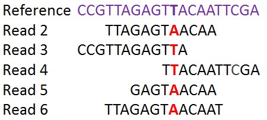

In this episode we will try to pinpoint single nucleotide variants or single nucleotide polymorphism (SNPs) between our samples and the reference. The SNPs are determined by a process called read mapping in which they are aligned to the reference sequence.

::::::::::::::::::::::::::::::::::::::: objectives

- Map reads against a reference genome
- Extract single nucleotide polymorphisms
- Establish a phylogenetic tree from the SNP data

::::::::::::::::::::::::::::::::::::::::::::::::::

:::::::::::::::::::::::::::::::::::::::: questions

- How to generate a phylogenetic tree from SNP data?

::::::::::::::::::::::::::::::::::::::::::::::::::

{alt='Mapping of SNP reads'}

The identified SNPs will be used to compare the isolates to each other and to establish a phylogenetic tree.

::::::::::::::::::::::::::::::::::::::::::::::::::::::::::::::::::::: instructor

## Getting missing data

If you don't have all the trimmed reads, you can download them (will take a while, *dont't do it if you have the reads*):

```bash
interactive -A uppmax2025-3-4 -M snowy -t 04:00:00
cd /proj/g2020004/nobackup/3MK013/<username>/molepi/data
mv trimmed_fastq trimmed_fastq_partial
tar xvzf ../../../data/trimmed_fastq.tar.gz
ls trimmed_fastq
```

:::::::::::::::::::::::::::::::::::::::::::::::::::::::::::::::::::::::::::::::

## SNP calling

[snippy](https://github.com/tseemann/snippy) is a pipeline that contains different tools to determine SNPs in sequencing reads against a reference genome. It takes forward and reverse reads of paired-end sequences and aligns them against a reference.

First we'll create a folder to hold the results from snippy:

```bash
interactive -A uppmax2025-3-4 -M snowy -t 04:00:00
cd /proj/g2020004/nobackup/3MK013/<username>/molepi/data
mkdir snps
```

We need to load snippy: 

```bash
module load bioinfo-tools snippy
```

Snippy is fast but a single run still takes about 15 minutes. We would therefore tell snippy to run all the samples after each other. However this time we cannot use a wildcard to do so. We would instead run all the samples in a loop. The "real" loop is commented out, and we use one that runs only the sample we've analyzed so far.  

```bash
cd ../data/trimmed_fastq/
#for sample in ERR026473 ERR026474 ERR026478 ERR026481 ERR026482 ERR029206 ERR029207
for sample in ERR029206
do
snippy --ram 8 --outdir ../../results/snps/"${sample}" --ref ../GCF_000195955.2_ASM19595v2_genomic.fna --R1 "${sample}"_1.fastq.gz_trim.fastq --R2 "${sample}"_2.fastq.gz_trim.fastq
done
```

Here, we provide snippy with an output folder (`--outdir`), the location of the reference genome (`--ref`), and the trimmed read files for each end of the pair (`--R1` and `--R2`). We also indicate that snippy should use 8 Gb of memory (`--ram 8`).

```bash
head -n10 ../../results/snps/ERR029206/snps.tab 
```

```output
CHROM	POS	TYPE	REF	ALT	EVIDENCE	FTYPE	STRAND	NT_POS	AA_POS	EFFECT	LOCUS_TAG	GENE	PRODUCT
NC_000962.3	1849	snp	C	A	A:217 C:0
NC_000962.3	1977	snp	A	G	G:118 A:0
NC_000962.3	4013	snp	T	C	C:176 T:0
NC_000962.3	7362	snp	G	C	C:156 G:0
NC_000962.3	7585	snp	G	C	C:143 G:0
NC_000962.3	9304	snp	G	A	A:127 G:0
NC_000962.3	11820	snp	C	G	G:164 C:0
NC_000962.3	11879	snp	A	G	G:125 A:0
NC_000962.3	14785	snp	T	C	C:163 T:1
```

This list gives us information on every SNP that was found by snippy when compared to the reference genome. The first SNP is found at the position 1849 of the reference genome, and is a C in the H37Rv (reference strain) and an A in isolate ERR029206. There is a high confidence associated with this SNP: an A has been found 217 times in the sequencing reads and never a C at this position.

Now copy a reduced version of the results on the other samples, save it in the `results` folder. We will also rename the existing `snps` folder to save it.

```bash
cd /proj/g2020004/nobackup/3MK013/<username>/molepi/results
mv snps snps_partial
mkdir snps
cd snps
tar xvzf ../../../../data/snps.tar.gz
ls *
```

```output
ERR026473:
ref.fa.          snps.bam.bai  snps.filt.vcf  snps.log	     snps.tab  snps.vcf.gz
ref.fa.fai	     snps.bed      snps.gff       snps.raw.vcf   snps.txt  snps.vcf.gz.csi
snps.aligned.fa  snps.csv      snps.html      snps.subs.vcf  snps.vcf

ERR026474:
ref.fa		       snps.bam.bai  snps.filt.vcf  snps.log	     snps.tab  snps.vcf.gz
ref.fa.fai	     snps.bed      snps.gff       snps.raw.vcf   snps.txt  snps.vcf.gz.csi
snps.aligned.fa  snps.csv      snps.html      snps.subs.vcf  snps.vcf
```

The folders don't contain everything that is output by `snippy`, to save space. But it is enough to run `snippy-core`.


:::::::::::::::::::::::::::::::::::::::  challenge

## Challenge: How many SNPs were identified in each sample??

Find out how many SNPs were identified in the *M. tuberculosis* isolates when compared to H37Rv. 
Hint: The `.txt` file in the snippy output contains summary information:

:::::::::::::::  solution

## Solution

```bash
cat /proj/g2020004/nobackup/3MK013/<username>/molepi/results/snps/ERR029207/snps.txt
```

```output
DateTime        2023-05-17T13:51:57
ReadFiles       [...]/data/trimmed_fastq/ERR029207_1.fastq.gz_trim.fastq [...]/data/trimmed_fastq/ERR029207_2.fastq.gz_trim.fastq
Reference       [...]/data/GCF_000195955.2_ASM19595v2_genomic.fna
ReferenceSize   4411532
Software        snippy 4.6.0
Variant-COMPLEX 32
Variant-DEL     57
Variant-INS     52
Variant-MNP     2
Variant-SNP     1290
VariantTotal    1433
```

This *M. tuberculosis* isolate contains 1290 SNPs compared to H37Rv.

Repeat this for the other isolates. How about using a `for` loop?

:::::::::::::::::::::::::

::::::::::::::::::::::::::::::::::::::::::::::::::

## Core SNPs

In order to compare the identified SNPs with each other we need to know if a certain position exists in all isolates. A core site can have the same nucleotide in every sample (monomorphic) or some samples can be different (polymorphic). 

In this second part, after identifying them, snippy will concatenate the core SNPs, i.e. ignoring sites that are monomorphic in all isolates and in the reference. Concatenation of the SNP sites considerably reduces the size of the alignment.

The `--ref` argument provides the reference genome. Each folder containing the result of the previous step of `snippy` is then added to the command line.

```bash
cd /proj/g2020004/nobackup/3MK013/<username>/molepi/results/snps
snippy-core --ref=../../data/GCF_000195955.2_ASM19595v2_genomic.fna ERR026473 ERR026474 ERR026478 ERR026481 ERR026482 ERR029206 ERR029207
```

The last few lines look like this:

```output
...
Loaded 1 sequences totalling 4411532 bp.
Will mask 0 regions totalling 0 bp ~ 0.00%
0	ERR026473	snp=1378	del=174	ins=165	het=747	unaligned=125683
1	ERR026474	snp=1369	del=180	ins=143	het=811	unaligned=123020
2	ERR026478	snp=1381	del=221	ins=143	het=638	unaligned=112145
3	ERR026481	snp=1349	del=215	ins=138	het=754	unaligned=126217
4	ERR026482	snp=1348	del=215	ins=145	het=911	unaligned=127554
5	ERR029206	snp=1352	del=152	ins=98	het=1839	unaligned=122677
6	ERR029207	snp=1355	del=152	ins=97	het=1900	unaligned=118570
Opening: core.tab
Opening: core.vcf
Processing contig: NC_000962.3
Generating core.full.aln
Creating TSV file: core.txt
Running: snp-sites -c -o core.aln core.full.aln
This analysis is totally hard-core!
Done.
```

Our output was written to 'core.aln'. But let's have a look at the results.

::::::::::::::::::::::::::::::::::::::  discussion

## Discussion: What's in the output of snippy??

Have a look at the content of these three files with `cat` or `head`.

`core.aln`

`core.full.aln`

`core.tab`

`core.txt`

What is the difference between these files? Why is core.aln smaller than ?
What is in core.aln?

::::::::::::::::::::::::::::::::::::::::::::::::::


## Phylogenetic tree

Phylogenetic trees have been discussed during the lectures. We will here establish a phylogenetic tree from the file 'core.aln' with [IQ-TREE](http://www.iqtree.org/). IQ-TREE is a phylogeny software based on the maximum-likelihood principle. IQ-TREE has been widely used and cited. There is a very wide range of parameters that need to be chosen, such as nucleotide or amino-acid substitution models.

In our case, we want IQ-TREE to automatically select the best substitution model. IQ-TREE does that by testing many (among a very large collection) substitution models. We also have SNP data, which by definition do not contain constant (invariable) sites. We thus input the alignment with the `-s` option and the model with `-m MFP+ASC`. `MFP` will tell IQ-TREE to test a range of models, and `ASC` will correct for the fact that there is no constant sites. 

```bash
module load iqtree
iqtree2 -s core.aln -m MFP+ASC
```

```output
...
Total wall-clock time used: 0.312 sec (0h:0m:0s)

Analysis results written to:
  IQ-TREE report:                core.aln.iqtree
  Maximum-likelihood tree:       core.aln.treefile
  Likelihood distances:          core.aln.mldist
  Screen log file:               core.aln.log

Date and Time: Thu May 18 09:00:37 2023
```

With this small data set, IQ-TREE finishes very quickly. Let's put the resulting files into a separate folder
and let's rename our resulting tree.

```bash
cd /proj/g2020004/nobackup/3MK013/<username>/molepi/results
mkdir tree
mv snps/core.aln.* tree
```

Let's inspect our tree, and give it another extension to make it clear it is a newick file.

```bash
cd /proj/g2020004/nobackup/3MK013/<username>/molepi/results
cd tree
mv core.aln.treefile core.aln.newick 
cat core.aln.newick
```

```output
(ERR026473:0.0004854701,ERR026474:0.0004356437,((((ERR026478:0.0000010000,ERR029207:0.0000010000):0.0000010000,ERR029206:0.0000131789):0.0006712219,Reference:0.0075887710):0.0000152316,(ERR026481:0.0000066238,ERR026482:0.0000131899):0.0005602421):0.0002373720);
```

This does not look much like a tree yet. The tree is written in a bracket annotation, the [Newick format](https://en.wikipedia.org/wiki/Newick_format). In order to make sense of it we can better view this in a tree viewer. 


:::::::::::::::::::::::::::::::::::::::  challenge

## Challenge: Can you identify what substitution model IQ-TREE used?

Hint: The log file of IQ-TREE contains a lot of information. 

:::::::::::::::  solution

## Solution

```bash
cat core.aln.iqtree
```

```output
...
Best-fit model according to BIC: TVMe+ASC
...
```

IQ-TREE chose the TVMe+ASC model. We've discussed the ASC above, and you can read more about the TVMe in the [IQ-TREE manual](https://www.iqtree.org/doc/Substitution-Models). In short, it is a mdoel where base frequencies are deemed equal, and all rates estimated independently, except the rates of transversions (A <-> G and C <-> T) are equal. 

:::::::::::::::::::::::::

::::::::::::::::::::::::::::::::::::::::::::::::::


:::::::::::::::::::::::::::::::::::::::: keypoints

- Single nucleotide polymorphisms can be identified by mapping reads to a reference genome
- Parameters for the analysis have to be selected based on expected outcomes for this organism
- Concatenation of SNPs helps to reduce analysis volume
- Phylogenetic trees can be written with a bracket syntax in Newick format

::::::::::::::::::::::::::::::::::::::::::::::::::


