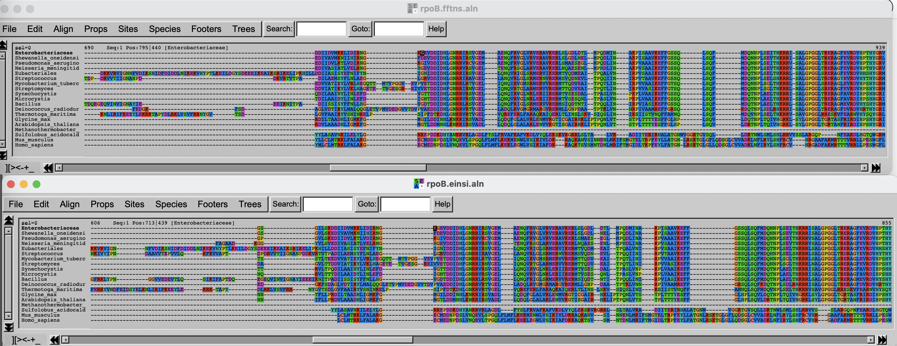
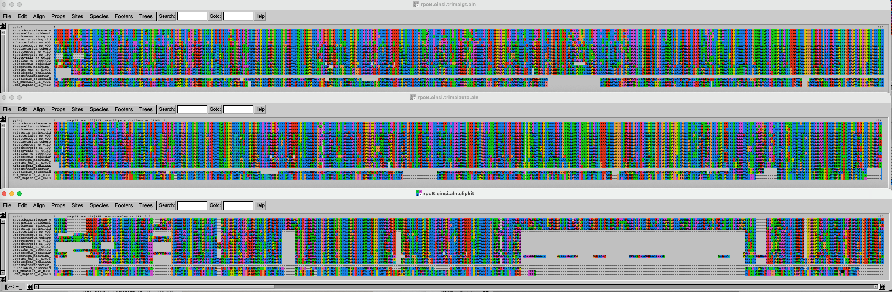
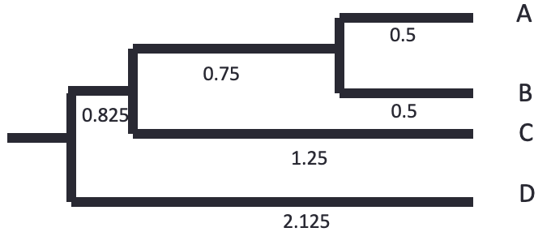
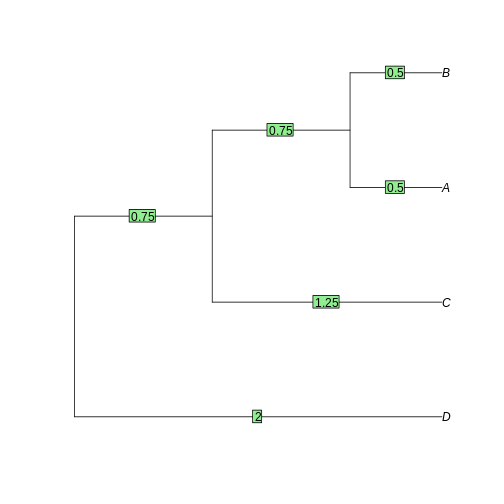

# Part 1: Multiple Sequence Alignment (MSA)

:::::::::::::::::::::::::::::::::::::: questions 

- How do you align multiple sequences?
- Why is it important to properly align sequences?

::::::::::::::::::::::::::::::::::::::::::::::::

::::::::::::::::::::::::::::::::::::: objectives

- Use `mafft` to align multiple sequences.
- Test different algorithms.

::::::::::::::::::::::::::::::::::::::::::::::::

<!--

Changelog VT2026
- Merged MSA and Phylogenetics to this episode
- Adaptation to pelle

-->


## Introduction

In this episode, we are exploring multiple sequence alignment (MSA). In the first task, you are going to use [`mafft`](https://mafft.cbrc.jp/alignment/software/algorithms/algorithms.html) to align homologs of [RpoB](https://en.wikipedia.org/wiki/RpoB), the β subunit of the bacterial RNA polymerase. It is a long, multi-domain protein, suitable for showing issues related to MSA. 

In the second task, you will trim that alignment to remove poorly aligned regions.

But first, go to your own folder and create a phylogenetics subfolder. You will use the alignments for other tutorials as well. 

## Task 1: Use different flavors of `MAFFT` and compare the results

Start by finding the data, which is a [fasta file](episodes/files/rpoB.fasta) containing 19 sequences of RpoB, gathered by aligning RpoB from *E. coli* to a very small database present at NCBI, the [landmark](https://blast.ncbi.nlm.nih.gov/smartblast/smartBlast.cgi?CMD=Web&PAGE_TYPE=BlastDocs) database. These sequences are a subset of the sequences gathered in the previous exercise on `BLAST`.

The file is available in `/proj/g2020004/nobackup/3MK013/data/`.  


:::::::::::::::::::::::::::::::::::::::  challenge

## Challenge 1.1: prepare the terrain

The course base folder is at `/proj/g2020004/nobackup/3MK013`. Go to your own folder, create a `phylogenetics` subfolder, and move into it. Also, start the `interactive` session, for 4 hours. The session name is `uppmax2026-1-93` and the cluster is `pelle`.

::: hint

Remember those commands?

```bash
ssh -Y
cd
mkdir
ls
interactive
```

::::::::

:::::::::::::::  solution

```bash
ssh -Y <username>@pelle.uppmax.uu.se
```

Remember to replace `<username>` by your name.

```bash
interactive -A <session> -M <cluster> -t <hh::mm::ss>
cd <basefolder>/<username>
mkdir <folder>
cd <folder>
```

:::::::::::::::::::::::::


:::::::::::::::  instructor

```bash
ssh -Y <username>@pelle.uppmax.uu.se
```

```bash
interactive -A uppmax2026-1-93 -M pelle -t 4:00:00
cd /proj/g2020004/nobackup/3MK013/<username>
mkdir phylogenetics
cd phylogenetics
```

:::::::::::::::::::::::::

## Challenge 1.2: copy the file

Copy the file to your newly created `phylogenetics` folder. Use a relative path.

::: hint

```bash
cp
pwd
ls ../..
```

::::::::

:::::::::::::::  solution

Use the `../../` to see what's two folders up, and then `data/rpoB/rpoB.fasta` 

:::::::::::::::::::::::::

:::::::::::::::  instructor

```bash
cp ../../data/rpoB/rpoB.fasta .
```

:::::::::::::::::::::::::


::::::::::::::::::::::::::::::::::::::::::::::::::


### Renaming sequences

Look at the accession ids of the fasta sequences: they are not very informative.

```bash
grep '>' rpoB.fasta | head -n 5
```

```output
>WP_000263098.1 MULTISPECIES: DNA-directed RNA polymerase subunit beta [Enterobacteriaceae]
>WP_011070610.1 DNA-directed RNA polymerase subunit beta [Shewanella oneidensis]
>WP_003114335.1 DNA-directed RNA polymerase subunit beta [Pseudomonas aeruginosa]
>WP_002228870.1 DNA-directed RNA polymerase subunit beta [Neisseria meningitidis]
>WP_003436174.1 MULTISPECIES: DNA-directed RNA polymerase subunit beta [Eubacteriales]
```

Keep the taxonomic name following the accession id, separated by `_`, using a bit of `sed` magic. Save the resulting file for later use, and show the headers again. 

```bash
sed "/^>/ s/>\([^ ]*\) \([^\[]*\)\[\(.*\)\]/>\\3_\\1/"  rpoB.fasta | sed "s/ /_/g" > rpoB_renamed.fasta
grep '>' rpoB_renamed.fasta | head -n 5
```

::: discussion

## Nerd alert: dissecting the `sed` magic

This is optional reading. 

The [`sed`](https://www.gnu.org/software/sed/manual/sed.html) command matches (and possibly substitutes) strings (chains of characters). In that case, the goal is to simplify the header by putting the taxonomic group first but keeping it informative enough by adding the accession number. The strategy is to match what is between the `>` and the first space, then what is between square parentheses, and put them back, separated by an underscore. 

The `sed` command first matches only lines that start with a `>` (`/^>/`). It then substitutes (general pattern `s/<something>/<something else>/`) a text with another one. The first part is to match the accession id, between (escaped) square brackets, which comes after the `>` at the beginning of the line. This is expressed as `>\([^ ]*\) `: match any number of non-space characters (`[^ ]*`) and put it in memory (what is between `\(` and `\)`). Then, the description is matched by `\([^\[]*\)`, any number of characters that are not an opening bracket `[`, and put into memory. Finally, the taxonomic description is matched: `\[\(.*\)\]`, that is, any number of characters between square brackets is stored into memory. The whole line is then replaced with a `>`, the third match into memory, followed by an `_` and the content of the first match into memory `>\\3_\\1`. Then, all the input is passed through sed again, to replace any space with an underscore: `s/ /_/g` and the output is stored in a different file.

::::::::::::::

```output
>Enterobacteriaceae_WP_000263098.1
>Shewanella_oneidensis_WP_011070610.1
>Pseudomonas_aeruginosa_WP_003114335.1
>Neisseria_meningitidis_WP_002228870.1
>Eubacteriales_WP_003436174.1
```

It looks better.

### Alignment with progressive algorithm

Use `mafft` with a progressive algorithm to align the sequences. 

:::::::::::::::::::::::::::::::::::::::  challenge

## Challenge 1.3: Run `mafft` with progressive algorithm

Use the FFT-NS-2 algorithm from `mafft` to align the renamed sequences. Also, record the time it takes for `mafft` to complete the task. 

::: hint

Use the `module` command to load `MAFFT`. Use `time` to record the time.

The help obtained through `mafft -h` is not very informative about algorithms, so check the [mafft webpage](https://mafft.cbrc.jp/alignment/software/algorithms/algorithms.html). 

`mafft` actually has one executable program for each algorithm, all starting with `mafft-`. A way to display them all is to type that and push the Tab key twice to see all possibilities.

::::::::

:::::::::::::::  solution

```bash
module load <mafft module>
time mafft-<algorithm> <fasta_file> > rpoB.fftns.aln
```

```output
...
[...]
Strategy:
 FFT-NS-2 (Fast but rough)
 Progressive method (guide trees were built 2 times.)

If unsure which option to use, try 'mafft --auto input > output'.
For more information, see 'mafft --help', 'mafft --man' and the mafft page.

The default gap scoring scheme has been changed in version 7.110 (2013 Oct).
It tends to insert more gaps into gap-rich regions than previous versions.
To disable this change, add the --leavegappyregion option.


real	0m1.125s
user	0m0.818s
sys	0m0.181s
```

The last line is the output of the `time` command. It took 1.125 seconds to complete this time.

:::::::::::::::::::::::::

:::::::::::::::  instructor

```bash
module load MAFFT
time mafft-fftns rpoB_renamed.fasta > rpoB.fftns.aln
```

:::::::::::::::::::::::::

::: hint

Type `mafft` and try tab-complete to see all versions of `mafft`.

Try the command `time` 

::: 

::::::::::::::::::::::::::::::::::::::::::::::::::

### Alignment with iterative algorithm

Now use one of the supposedly better iterative algorithm of `mafft` to align the same sequences. Choose the [E-INS-i algorithm](https://mafft.cbrc.jp/alignment/software/algorithms/algorithms.html) which is suited for proteins that have highly conserved motifs interspersed with less conserved ones. 

Take a few minutes to read upon the different alignment strategies on the page above.

:::::::::::::::::::::::::::::::::::::::  challenge

## Challenge 1.4

Use the superior E-INS-i algorithm from mafft to align the renamed sequences. Also, record the time it takes for `mafft` to complete the task. 

:::::::::::::::  solution

```bash
time mafft-<better algo> <fasta file> > rpoB.einsi.aln
```

```output
[...]
Strategy:
 E-INS-i (Suitable for sequences with long unalignable regions, very slow)
 Iterative refinement method (<16) with LOCAL pairwise alignment with generalized affine gap costs (Altschul 1998)

If unsure which option to use, try 'mafft --auto input > output'.
For more information, see 'mafft --help', 'mafft --man' and the mafft page.

The default gap scoring scheme has been changed in version 7.110 (2013 Oct).
It tends to insert more gaps into gap-rich regions than previous versions.
To disable this change, add the --leavegappyregion option.

Parameters for the E-INS-i option have been changed in version 7.243 (2015 Jun).
To switch to the old parameters, use --oldgenafpair, instead of --genafpair.


real	0m7.367s
user	0m7.022s
sys	0m0.244s
```

It now took 7.36 seconds to complete this time, i.e. 6 times more than with the progressive algorithm. It doesn't make a big difference now, but with hundreds of sequences it will make one.

:::::::::::::::::::::::::

:::::::::::::::  instructor

```bash
time mafft-einsi rpoB_renamed.fasta > rpoB.einsi.aln
```

:::::::::::::::::::::::::

::::::::::::::::::::::::::::::::::::::::::::::::::

### Alignment visualization 

You will now inspect the two resulting alignment methods. There are no convenient way to do that from Uppmax, and the easiest solution is to download the alignments **on your computer** and to use either [`seaview`](https://doua.prabi.fr/software/seaview) (you will need to install it on your computer) or an online alignment viewer like [AlignmentViewer](https://alignmentviewer.org/). 

Arrange the two windows on top of each other. Change the fontsize (Props -> Fontsize in Seaview) to 8 to see a larger portion of the alignment. 

:::::::::::::::::::::::::::::::::::::::  challenge

Can you spot differences? Which alignment is longer?

Hint: try to scroll to position 800-900. What do you see there? How are the blocks arranged?

:::::::::::::::  solution

Use `scp` to copy files from Uppmax to your computer. `scp` allows wildcards, but you probably need to escape the `*`.

```bash
scp <username>@pelle.uppmax.uu.se:/<absolute path to phylogenetics folder>/rpoB.\*.aln <localfolder>/
```

{alt='Alignments shown in seaview'}

::::::::::::::::::::::::::::::::::::::::::::::::::

:::::::::::::::  instructor

```bash
scp lionel@pelle.uppmax.uu.se:/proj/g2020004/nobackup/3MK013/<user>/phylogenetics/rpoB.\*.aln .
```

::::::::::::::::::::::::::::::::::::::::::::::::::


::::::::::::::::::::::::::::::::::::::::::::::::::

If you have time over, spend it exploring the different options of Seaview/AlignmentViewer.

## Task 2: Trim the alignment 

Often, some regions of the alignment don't align properly, either because they contain low complexity segments (hinges in proteins) or evolved through repeated insertions/deletions, which alignment program cannot handle properly. It is thus good practice to remove (trim) these regions, as they are likely to worsen the quality of the subsequent phylogenetic trees. On the other hand, trimming too much of the alignment removes also potentially valuable information. There is thus a balance to be found. 

In this part, you will use two different alignment trimmers, [`TrimAl`](http://trimal.cgenomics.org/) and [`ClipKIT`](https://jlsteenwyk.com/ClipKIT/), on the results of `mafft`'s E-INS-i algorithm.

### Trimming with TrimAl

First, load the module and look at the list of options available with `trimAl`. 

```bash
module load trimAl
trimal -h
```

`trimAl` offers a lot of different options. You are going to explore two different: gap threshold (`-gt`) and the heuristic method `-automated1`, which automatically decides between three automated methods, `-gappyout`, `-strict` and `-strictplus`, based on the properties of the alignment. The gap threshold methods removes columns that contain a fraction of sequences lower than the cut-off.


For comparison purposes, you will be adding an html output.

:::::: challenge

## Challenge 2.1: TrimAl with gap threshold

Use `trimAl` to remove positions in the alignment that have more than 40% gaps. 

::: hint

The "gap threshold" is actually expressed as fraction of non-gap residues.

::::::::

::: solution

```bash
trimal -in <input aln> -out rpoB.einsi.trimalgt.aln -gt <cut-off> -htmlout <html_output>
```

::::::::::::

::: instructor

```bash
trimal -in rpoB.einsi.aln -out rpoB.einsi.trimalgt.aln -gt 0.6 -htmlout rpoB.einsi.trimalgt.aln.html
```

::::::::::::


## Challenge 2.2: TrimAl with automated trimming

Use `trimAl` with the automated heuristic algorithm. 

::: solution

Add a `-automated1` option and rerun as above, choosing a different output file.

::::::::::::

::: instructor

```bash
trimal -in rpoB.einsi.aln -out rpoB.einsi.trimalauto.aln -automated1 -htmlout rpoB.einsi.trimalauto.aln.html
```

::::::::::::


## Challenge 2.3: Compare the results

Get the files (both alignments and html files) to your own laptop and visualize the results, by opening the `html` files with your browser and the alignment files with `seaview` or the viewer you used above.

::: solution

On your own laptop, go inside the folder where you want to import the files. Use `scp`. On some OS it is necessary to escape the wildcard `*`. If the output says something about `no matches found`, try that.

As before, if you do not have access to a terminal on your windows laptop, use MobaXterm and Session > SFTP to copy files to your computer.

::::::::::::

::: instructor

```bash
scp <username>@pelle.uppmax.uu.se:/proj/g2020004/nobackup/3MK013/<username>/phylogenetics/rpoB.einsi.trimal\* .
scp <username>@pelle.uppmax.uu.se:/proj/g2020004/nobackup/3MK013/<username>/phylogenetics/rpoB.einsi.trimal* .
```

::::::::::::

::::::::::::::::

### Trimming with ClipKIT

[`ClipKIT`](https://jlsteenwyk.com/ClipKIT/) is one of the more recent tools to trim multiple sequence alignments. In a nutshell, it tries to preseve phylogenetically-informative sites, rather than trimming gappy regions. Although it also has multiple options and modes, you will only use the default mode, `smart-gap`.


:::::: challenge

## Challenge 2.4: Use ClipKIT

To get an idea of the modes and options, load the `ClipKIT` module and look at the help page:

```bash
module load ClipKIT
clipkit -h
```

Then run ClipKIT, explicitly using the `smart-gap` mode. Compare how much ClipKIT has trimmed the original alignment compared to trimAl.

::: solution

```bash
module load ClipKIT
clipkit -h
```

```bash
clipkit <input aln> -m <mode> -l -o <output file>
```

```output
---------------------
| Output Statistics |
---------------------
Original length: 2043
Number of sites kept: 1543
Number of sites trimmed: 500
Percentage of alignment trimmed: 24.474%

Execution time: 0.379s
```

::::::::::::

::: instructor

```bash
module load ClipKIT
clipkit -h
clipkit rpoB.einsi.aln -m smart-gap -l -o rpoB.einsi.clipkit.aln
```

::::::::::::

::::::::::::::::

### Comparing all the results

Import the data and inspect the three alignments.

:::::: challenge

## Challenge 2.5: Import data and compare results

Copy the alignment file and visualize with `seaview` or the web-based visualization tool.

::: hint

Use `scp` as above. 

Then use `seaview` or another viewer to visualize and compare results.

::::::::

::: solution

The three alignments on top of each other look like this. Click [on this link](episodes/fig/seaview_trimal_vs_clipkit.png) to better see the figure.

{alt='Alignments shown in seaview'}

::::::::::::

::: instructor

```bash
scp <username>@pelle.uppmax.uu.se:/proj/g2020004/nobackup/3MK013/<username>/phylogenetics/rpoB.einsi.clipkit.aln .

```

Then use `seaview` or another viewer to visualize and compare results.

::::::::::::

::::::::::::::::


It is of course difficult to draw conclusions based on this figure, but can you spot some trends? What alignment is more likely to generate good results?

# Part 2: Phylogenetics

:::::::::::::::::::::::::::::::::::::: questions 

- How do you build a simple, distance-based phylogenetic tree?
- How do you build a phylogenetic tree with more advanced methods?
- How do you ascertain statistical support for phylogenetic trees?

::::::::::::::::::::::::::::::::::::::::::::::::

::::::::::::::::::::::::::::::::::::: objectives

- Learn the basic of phylogenetics tree building, taking the simplest of the examples with a UPGMA tree.
- Learn how to use phylogenetics algorithms, neighbor-joining and maximum-likelihood.
- Learn how to perform and show bootstraps.

::::::::::::::::::::::::::::::::::::::::::::::::


## Task 3: Paper-and-pen phylogenetic tree

### Setup

The exercise is done for a large part with pen and paper, and then a demonstration in R on your laptop, using RStudio. We'll also use the R package [`ape`](https://emmanuelparadis.github.io/), which you should install if it's not present on your setup. Commands can be typed or pasted in the "Console" part of RStudio.


``` r
install.packages('ape')
```

``` output
- Querying repositories for available source packages ... Done!
The following package(s) will be installed:
- ape [5.8-1]
These packages will be installed into "~/work/course-microbial-genomics/course-microbial-genomics/renv/profiles/lesson-requirements/renv/library/linux-ubuntu-jammy/R-4.5/x86_64-pc-linux-gnu".

# Installing packages --------------------------------------------------------
✔ ape 5.8-1                                [linked from cache]
Successfully installed 1 package in 3.2 milliseconds.
```

And to load it:


``` r
library(ape)
```


### UPGMA-based tree

Load the tree in fasta format, reading from a `temp` file

``` r
FASTAfile <- tempfile("aln", fileext = ".fasta")
cat(">A", "----ATCCGCTGATCGGCTG----",
    ">B", "GCTGATCCGTTGATCGG-------",
    ">C", "----ATCTGCTCATCGGCT-----",
    ">D", "----ATTCGCTGAACTGCTGGCTG",
    file = FASTAfile, sep = "\n")
aln <- read.dna(FASTAfile, format = "fasta")
```
Now look at the alignment. Notice there are gaps, which we don't want in this example. We also remove the non-informative (identical) columns. 


``` r
alview(aln)
```

``` output
  000000000111111111122222
  123456789012345678901234
A ----ATCCGCTGATCGGCTG----
B GCTG.....T.......---....
C .......T...C.......-....
D ......T......A.T....GCTG
```

``` r
aln_filtered <- aln[,c(7,8,10,12,14,16)]
alview(aln_filtered)
```

``` output
  123456
A CCCGTG
B ..T...
C .T.C..
D T...AT
```
Now we have a simple alignment as in the lecture. Dots (`.`) mean that the sequence is identical to the top row, which makes it easier to calculate distances.

::::::::::::::::::::::::::::::::::::: challenge 

### Calculating distance "by hand"

Let's use a matrix to calculate distances between sequences. We'll just count the number of differences between the sequences. We'll then group the two closest sequences. Which are they?

Table: Distances between the sequences.

|   | A  | B  | C  | D  |
| - | -: | -: | -: | -: |
| A |    |    |    |    |
| B |    |    |    |    |
| C |    |    |    |    |
| D |    |    |    |    |

:::::::::::::::::::::::: solution 

Here is the solution:

Table: Distances between the sequences.

|   | A  | B  | C  | D  |
| - | -: | -: | -: | -: |
| A |    |    |    |    |
| B |  1 |    |    |    |
| C |  2 | 3  |    |    |
| D |  3 | 4  | 5  |    |

The two closest sequences are A and B.

:::::::::::::::::::::::::::::::::

Let's now cluster together A and B, and calculate the average distance from AB to the other sequences, weighted by the size of the clusters. 

Table: Recalculated distances.

|    | AB  | C  | D  |
| -  | -:  | -: | -: |
| AB |     |    |    |
| C  |     |    |    |
| D  |     |    |    |

:::::::::::::::::::::::: solution 

The average distance for AB to C is calculated as follow:

$d(AB,C) = \dfrac{d(A,C) + d(B,C)}{2} = \dfrac{2 + 3}{2} = 2.5$

And so on for the other distances:

Table: Recalculated distances.

|    | AB  | C  | D  |
| -  | -:  | -: | -: |
| AB |     |    |    |
| C  | 2.5 |    |    |
| D  | 3.5 |  5 |    |

:::::::::::::::::::::::::::::::::

Now the shortest distance is AB to C. Let's recalculate the distance to D again.

Table: Recalculated distances.

|    | ABC | D  |
| -  | -:  | -: |
| ABC|     |    |
| D  |     |    |

:::::::::::::::::::::::: solution 

$d(ABC,D) = \dfrac{d(AB,D) * 2 + d(C,D) * 1}{2 + 1} = \dfrac{3.5 * 2 + 5 * 1}{3} = 4$

Table: Recalculated distances.

|    | ABC | D  |
| -  | -:  | -: |
| ABC|     |    |
| D  | 4   |    |

:::::::::::::::::::::::::::::::::

::::::::::::::::::::::::::::::::::::::::::::::::

The tree is reconstructed by dividing the distances equally between the two leaves. 
- A-B: each 0.5.
- AB-C: each side gets 2.5/2 = 1.25. The branch to AB is 1.25 - 0.5 = 0.75
- ABC-D: each side gets 4/2 = 2. The branch to ABC is 2 - 0.75 - 0.5 = 0.75

{alt='Manually built UPGMA tree'}


Let's know do the same using bioinformatics tools. 

::::::::::::::::::::::::::::::::::::: challenge 

We'll use `dist.dna` to calculate the distances. We'll use a "N" model, that just counts the differences and doesn't correct or normalizes. We'll use the function `hclust` to perform the UPGMA method calculation. The tree is then plotted, and the branch lengths plotted with `edgelabels`:

:::::::::::::::::::::::: solution 


``` r
dist_matrix <- dist.dna(aln_filtered, model="N")
dist_matrix
```

``` output
  A B C
B 1    
C 2 3  
D 3 4 5
```

``` r
tree <- as.phylo(hclust(dist_matrix, "average"))
plot(tree)
edgelabels(tree$edge.length)
```



:::::::::::::::::::::::::::::::::

::::::::::::::::::::::::::::::::::::::::::::::::

## Task 4: Neighbor-joining and Maximum-likelihood tree

### Introduction

In the previous episode, we inferred a simple phylogenetic tree using UPGMA, without correcting the distance matrix for multiple substitutions. UPGMA has many shortcomings, and gets worse as distance increases. Here we'll test Neighbor-Joining, which is also a distance-based, and a maximum-likelihood based approach with [IQ-TREE](http://www.iqtree.org/).

### Neighbor-joining

The principle of [Neighbor-joining method](https://en.wikipedia.org/wiki/Neighbor_joining) (NJ) is to start from a star-like tree, find the two branches that, if joined, minimize the total tree length, join then, and repeat with the joined branches and the rest of the branches.

::::::::::::::::::::::::::::::::::::: challenge 

To perform NJ on our sequences, we'll use the function inbuilt in Seaview. First (re-)open the alignment we obtained from `mafft` with the E-INS-i method, trimmed with ClipKIT. If it is not on your computer anymore, transfer it again from Uppmax using `scp` or `SFTP`.

If [Seaview](https://doua.prabi.fr/software/seaview) is not installed on your computer, download it and install it on your computer. 

:::::::::::::::::::::::: solution 

On a Linux computer, you can run it on the command line:

```bash
seaview rpoB.einsi.clipkit.aln &
```

On other computers, just open the file with the regular File > Open menu.

:::::::::::::::::::::::::::::::::

In the Seaview window, select Trees -> Distance methods. Keep the BioNJ option ticked. BioNJ is an updated version of NJ, more accurate for longer distances. Tick the "Bootstrap" option and leave it at 100. We'll discuss these later. Then click on "Go".

::::::::::::::::::::::::::::::::::::::::::::::::

What do you see? Is the tree rooted? Is the pattern species coherent with what you know of the tree of life? Any weird results?

::::::::::::::::::::::::::::::::::::: challenge 

Redo the BioNJ tree for the other alignment we inferred.

:::::::::::::::::::::::: solution 

```bash
seaview rpoB.fftns.aln &
```

:::::::::::::::::::::::::::::::::

::::::::::::::::::::::::::::::::::::::::::::::::

Do you see any differences between the two trees? What can you make out of it?

### Maximum likelihood

We will now use IQ-TREE to infer a maximum-likelihood (ML) tree of the RpoB dataset we aligned with `mafft` previously. While you performed the first trees on your laptop, you will infer the ML tree on Uppmax. As usual, use the `interactive` command to gain access to compute time. Go to the `phylogenetics` folder created in the MSA episode, and load the right modules.

:::::: challenge

Get to the right folder, require compute time and load the right modules. The project is `uppmax2026-1-93`. The module containing IQ tree is called `IQ-TREE`.

::: hint

 ```bash
interactive ...
module load ...
```

::::::::::::

::: solution

 ```bash
interactive -A <project> -M <cluster> -t <time>
module load IQ-TREE
```

::::::::::::


::: instructor

 ```bash
interactive -A uppmax2026-1-93 -M pelle -t 4:00:00
module load IQ-TREE
cd /proj/g2020004/nobackup/3MK013/<username>/phylogenetics
```

::::::::::::

::::::::::::::::

Then run your first tree, on the `ClipKIT`-trimmed alignment.

```bash
iqtree -s rpoB.einsi.clipkit.aln -m MFP -B 1000
```

Here, we tell IQ-TREE to use the alignment `-s rpoB.einsi.clipkit.aln`, and to test among the standard substitution models which one fits best (`-m MFP`). We also tell IQ-TREE to perform 1000 ultra-fast bootstraps (`-B 1000`). We'll discuss these later.

IQ-TREE is a very complete program that can do a large variety of phylogenetic analysis. To get a flavor of what it's capable of, look at its [extensive documentation](http://www.iqtree.org/doc/). 

Have a look at the output files:

```bash
ls rpoB.einsi.clipkit.aln.*
```

```output
rpoB.einsi.clipkit.aln.bionj    rpoB.einsi.clipkit.aln.iqtree  rpoB.einsi.clipkit.aln.model.gz
rpoB.einsi.clipkit.aln.ckp.gz   rpoB.einsi.clipkit.aln.log     rpoB.einsi.clipkit.aln.splits.nex
rpoB.einsi.clipkit.aln.contree	rpoB.einsi.clipkit.aln.mldist  rpoB.einsi.clipkit.aln.treefile
```

There are two important files:  
* `*.iqtree` file provides a text summary of the analysis. 
* `*.treefile` is the resulting tree in [Newick format](https://en.wikipedia.org/wiki/Newick_format). 

To visualize the tree, open the [Beta version of phylo.io](https://beta.phylo.io/viewer/#). Click on "add a tree" and copy/paste the content of the `treefile` (use e.g. `less` or `cat` to display it) in the box. Make sure the "Newick format" is selected and click on "Done". 

The tree appears as unrooted. It is good practice to start by ordering the nodes and root it. There is no good way to automatically order the branches in phylo.io as of yet, but rerooting can be done by clicking on a branch and selecting "Reroot". Reroot the tree between archaea and bacteria. Now the tree makes a bit more sense. 

Scrutinize the tree. Is it different from the BioNJ tree generated in Seaview? How?

::::::::::::::::::::::::::::::::::::: challenge 

Redo a ML tree from the other alignment (FFT-NS) we inferred with `mafft` and display the resulting tree in FigTree.


::: hint

```bash
iqtree -h
```
::::::::

:::::::::::::::::::::::: solution 

```bash
iqtree -s <alignment file> <option and text for testing model> <option and test for 1000 fast bootstraps> 
```

Import the tree **on your computer** and load it with FigTree or with [phylo.io](https://beta.phylo.io/viewer/#)

```bash
figtree rpoB.fftns.aln.treefile &
```

:::::::::::::::::::::::::::::::::

:::::::::::::::::::::::: instructor 

```bash
iqtree -s rpoB.fftns.aln -m MFP -B 1000
```

```bash
figtree rpoB.fftns.aln.treefile &
```

:::::::::::::::::::::::::::::::::

::::::::::::::::::::::::::::::::::::::::::::::::

### Bootstraps

We have inferred four trees:

* Two based on the alignment generated from the E-INS-i algorithm (trimmed by ClipKIT), two from the FFT-NS.
* Two inferred with the BioNJ algorithm and two with the ML algorithm (IQ-Tree)

Along the way, we've generated bootstraps for all our trees. Now show them on all four trees.

* For the Seaview trees, tick the 'Br support' box
* For the trees shown in phylo.io, click on "Settings" > "Branch & Labels" and above the branch, click the drop-down menu and select "Data". 

::::::::::::::::::::::::::::::::::::: challenge 

Compare all four trees. Do you find any significant differences? 

::: hint

What are *Glycine* and *Arabidopsis*? What about *Synechocystis* and *Microcystis*?

::::::::

::: hint

Search for the accession number of the *Glycine* RpoB sequence on [NCBI](https://www.ncbi.nlm.nih.gov/search/). Any hint there?

::::::::

:::::::::::::::::::::::: solution 

The two plant RpoB sequences are from chloroplastic genomes, and thus branch together with the cyanobacterial sequences, in some of the phylogenies at least. 

:::::::::::::::::::::::::::::::::

What about the support values for grouping these two groups? How high are they?

::::::::::::::::::::::::::::::::::::::::::::::::


::::::::::::::::::::::::::::::::::::: keypoints 


- The simplest of the trees are distance-based.
- UPGMA works by clustering the two closest leaves and recalculating the distance matrix.
- Neighbor-joining is distance-based and fast, but not necessarily very accurate
- Maximum-likelihood is slower, but more accurate

::::::::::::::::::::::::::::::::::::::::::::::::

# Part 3: Genetic drift

As a practical way to understand genetic drift, let's play with population size, selection coefficients, number of generations, etc.

:::::::::::::::::::::::::::::::::::::: questions 

- How does random genetic drift influence fixation of alleles?
- What is the influence of population size?

::::::::::::::::::::::::::::::::::::::::::::::::

::::::::::::::::::::::::::::::::::::: objectives

- Understand how population size influences the probability of fixation of an allele.
- Understand how slightly deleterious mutations may get fixed in small populations.

::::::::::::::::::::::::::::::::::::::::::::::::

## Introduction

This exercise is to illustrate the concepts of selection, population size and genetic drift, using simulations. We will use mostly [Red Lynx] by [Reed A. Cartwright](https://github.com/reedacartwright). 

Another option is to use a [web interface](https://phytools.shinyapps.io/drift-selection/) to the [R] [learnPopGen](https://github.com/liamrevell/learnPopGen) package, but the last one is mostly for biallelic genes (and thus not that relevant for bacteria).

Open now the [Red Lynx] website and get familiar with the different options. 

You won't need the right panel (but feel free to explore). The dominance option in the left panel won't be used either.


::::::::::::::::::::::::::::::::::::: challenge 

## Task 6: Genetic Drift without selection

In the first part, you will only play with the number of generations, the initial frequency and the population size. 

- Lower the number of generations to 200. 
- Adjust the population size to 1000.
- Make sure the intial frequency is set to 50%.
- Run a few simulations (ca 20).

Did any allele got fixed? What is the range of frequencies after 200 generations?

:::::::::::::::::::::::: solution 

In my simulations, no allele got fixed, the final allele frequencies range 20-80%

:::::::::::::::::::::::::::::::::

Now increase the population to 100'000, clear the graph, and repeat the simulations. What's the range of final frequencies now?

:::::::::::::::::::::::: solution 

In my simulations, no allele got fixed, and the final allele frequencies range 45-55%

:::::::::::::::::::::::::::::::::

Now decrease the population to 10 individuals, clear the graph and repeat these simulations. What's the range of final frequencies now?

:::::::::::::::::::::::: solution 

In my simulations, one allele got fixed quickly, the latest one was at generation 100.

:::::::::::::::::::::::::::::::::

What do you conclude here?

:::::::::::::::::::::::: solution 

It is clear that stochastic (random) variation in allele frequencies strongly affects the probability of fixation of alleles in small populations, not so much in large ones.

:::::::::::::::::::::::::::::::::

::::::::::::::::::::::::::::::::::::::::::::::::

::::::::::::::::::::::::::::::::::::: challenge 

## Task 7: Genetic Drift with selection

So far we've only looked at how allele frequencies vary in the absence of selection, that is when the two alleles provide an equal fitness. What's the influence of random genetic drift when alleles are not neutral?

The selection strength is equivalent to the selection coefficient, i.e. how much higher relative fitness the new allele provides. A selection coefficient of 0.01 means that the organism harboring the new allele has a 1% increased fitness.

- Increase the number of generations to 1000.
- Set the selection strength to 0.01 (1%).
- Set the population size first to 100'000, then to 1000, then to 100.

How long does it take for the allele to get fixed - in average - with the three population sizes?

:::::::::::::::::::::::: solution 

About the same time, but the trajectories are much smoother with larger populations. In the small population, it happens that the beneficial allele disappears from the population (although not often).

:::::::::::::::::::::::::::::::::

## Task 8: Fixation of slightly deleterious alleles in very small populations

We're now simulating what would happen in a very small population (or a population that undergoes very narrow bottlenecks), when a gene mutates. We'll have a very small population (10 individuals), a selection value of -0.01 (the mutated allele provides a 1% lower fitness), and a 10% initial frequency, which corresponds to one individual getting a mutation:

- Set the population to 10 individuals.
- Set generations to 200.
- Set initial frequency to 10%.
- Set the selection strength to -0.01.

Run many simulations. What happens?

:::::::::::::::::::::::: solution 

Most new alleles go extinct quickly. In my simulations, I usually get one of the slightly deleterious mutations fixed after 20 simulations.

:::::::::::::::::::::::::::::::::
::::::::::::::::::::::::::::::::::::::::::::::::

That's it for that part, but feel free to continue playing with the different settings later.

::::::::::::::::::::::::::::::::::::: keypoints 

- Random genetic drift has a large influence on the probability of fixation of alleles in small populations, even for non-neutral alleles.
- Random genetic drift has very little influence of the probability of fixation of alleles in large populations.
- Slightly deleterious mutations can get fixed into the population through random genetic drift, if the population is small enough and the selective value is not too large.

::::::::::::::::::::::::::::::::::::::::::::::::


<!-- References -->

[Red Lynx]: https://cartwrig.ht/apps/redlynx/

