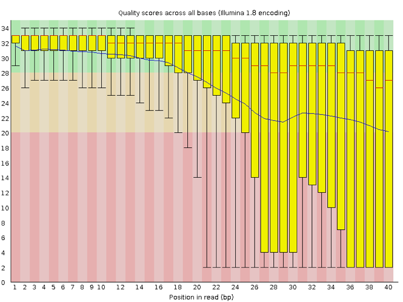

This episode starts a series of labs where you will trace an outbreak of *Mycobacterium tuberculosis*, from downloading the reads to making assumptions about the transmissions between patients. 

The first part, here, describes how to retrieve all necessary data from public repositories - the raw sequenced data of our isolates and a reference genome. It also introduces for loops which we will use for the rest of our analysis.

::: objectives

- How do you use genomics and phylogenetics to trace a microbial outbreak?
- Create a file system for a bioinformatics project.
- Download files necessary for further analysis.
- Use 'for' loops to automate operations on multiple files
- Interpret a FastQC plot summarizing per-base quality across all reads.
- Clean FastQC reads for further analysis.
- Use `for` loops to automate operations on multiple files.

:::

::: questions

- Trace an outbreak of Mycobacterium, from reads to phylogenetic tree.
- How can I organize my file system for a new bioinformatics project?
- How and where can data be downloaded?
- How can I describe the quality of my data?
- How can I get rid of sequence data that doesn't meet my quality standards?

:::

## Introduction

This part of the course is largely inspired from [another tutorial](https://github.com/aschuerch/MolecularEpidemiology_AnalysisWGS) developed by [Anita Schürch](https://aschuerch.github.io/). We will use (part of) the data described in [Bryant et al., 2013](https://bmcinfectdis.biomedcentral.com/articles/10.1186/1471-2334-13-110). 


## Background of the data

Epidemiological contact tracing through interviewing of patients can identify potential chains of patients that transmitted an infectious disease to each other. Contact tracing was performed following the [stone-in-the-pond principle](https://www.ncbi.nlm.nih.gov/pubmed/1643300), which  interviews and tests potential contacts in concentric circles around a potential bash case.

Tuberculosis (TB) is an infectious disease caused by *Mycobacterium tuberculosis*. It mostly affects the lungs. An infection with *M. tuberculosis* is often asymptomatic (latent infection). Only in about 10% of the cases the latent infection progresses to an active infection during a patients lifetime, which, if untreated, leads to death in about half of the cases. The symptoms of an active TB infection include cough, fever, night sweats, weight loss etc. An active TB infection can spread. Once exposed, people often have latent TB. To identify people with latent TB, a [skin test](https://www.cdc.gov/tb/publications/factsheets/testing/skintesting.htm) can be applied.

Here we have 7 tuberculosis patients with active TB, that form three separate clusters of potential transmission as determined by epidemiological interviews. Patients were asked if they have been in direct contact with each other, or if they visited the same localities. From all patients, a bacterial isolate was grown, DNA isolated, and whole-genome sequenced on an Illumina sequencer.

The three clusters consist of:

* Cluster 1
  + Patient A1 (2011) - sample ERR029207
  + Patient A2 (2011) - sample ERR029206
  + Patient A3 (2008) - sample ERR026478
* Cluster 2
  + Patient B1 (2001) - sample ERR026474
  + Patient B2 (2012) - sample ERR026473
* Cluster 3
  + Patient C1 (2011) - sample ERR026481
  + Patient C2 (2016) - sample ERR026482


The second goal of this lab is to affirm or dispute the inferred transmissions by comparing the bacterial genomes with each other. We will do that by identifying SNPs between the genomes.


## Getting your project started

Project organization is one of the most important parts of a sequencing project, and yet is often overlooked amidst the excitement of getting a first look at new data. Of course, while it's best to get yourself organized before you even begin your analyses,it's never too late to start, either.

Genomics projects can quickly accumulate hundreds of files across tens of folders. Every computational analysis you perform over the course of your project is going to create many files, which can especially become a problem when you'll inevitably want to run some of those analyses again. For instance, you might have made significant headway into your project, but then have to remember the PCR conditions you used to create your sequencing library months prior.

Other questions might arise along the way:

-   What were your best alignment results?
-   Which folder were they in: Analysis1, AnalysisRedone, or AnalysisRedone2?
-   Which quality cutoff did you use?
-   What version of a given program did you implement your analysis in?

In this exercise we will setup a file system for the project we will be working on during this workshop.

We will start by creating a sub directory that we can use for the rest of the labs. First navigate to your own directory on Uppmax and start an `interactive` session. Then confirm that you are in the correct directory using the `pwd` command.

```bash
interactive -A uppmax2025-3-4 -M snowy -t 04:00:00
cd /proj/g2020004/nobackup/3MK013/<username>
pwd
```

You should see the output:

```output
/proj/g2020004/nobackup/3MK013/<username>
```

::: challenge
## Exercise

Use the `mkdir` command to make the following directories:

```         
molepi
molepi/docs  
molepi/data  
molepi/results
```

::: solution
## Solution

```bash
mkdir molepi
mkdir molepi/docs
mkdir molepi/data
mkdir molepi/results
```
:::
:::

Use `ls -R` to verify that you have created these directories. The `-R` option for `ls` stands for recursive. This option causes `ls` to return the contents of each subdirectory within the directory iteratively.

```bash
ls -R molepi
```

You should see the following output:

```output
molepi/:
data  docs  results

molepi/data:

molepi/docs:

molepi/results: 
```

## Selection of a reference genome

Reference sequences (including many pathogen genomes) are available at [NCBI's refseq database](https://www.ncbi.nlm.nih.gov/refseq/)

A reference genome is a genome that was previously sequenced and is closely related to the isolates we would like to analyse. The selection of a closely related reference genome is not trivial and will warrant an analysis in itself. However, for simplicity, here we will work with the *M. tuberculosis* reference genome H37Rv.

### Download reference genomes from NCBI

Download the *M.tuberculosis* reference genome from the NCBI ftp site.

First, we switch to the data folder to store all our data

```bash
cd molepi/data 
```

The reference genome will be downloaded programmatically from NCBI with `wget`. `wget` is a computer program that retrieves content from web servers. Its name derives from World Wide Web and get.

```bash
wget ftp://ftp.ncbi.nlm.nih.gov/genomes/all/GCF/000/195/955/GCF_000195955.2_ASM19595v2/GCF_000195955.2_ASM19595v2_genomic.fna.gz
```

This file is compressed as indicated by the extension of `.gz`. It means that this file has been compressed using the `gzip` command.

Extract the file by typing

```bash
gunzip GCF_000195955.2_ASM19595v2_genomic.fna.gz
```

Make sure that is was extracted

```bash
ls
```

``` output
GCF_000195955.2_ASM19595v2_genomic.fna
```

::: challenge
## Challenge: What is the size of the genome?

Find out how many nucleotides the genome has. Hint:

```bash   
module load bioinfo-tools SeqKit
seqkit -h
```

Get assembly statistics from FASTA and FASTQ files.

::: solution
## Solution

The genome has 4'411'532 bp.

``` bash
seqkit stats GCF_000195955.2_ASM19595v2_genomic.fna
```

``` output
file                                    format  type  num_seqs    sum_len    min_len    avg_len    max_len
GCF_000195955.2_ASM19595v2_genomic.fna  FASTA   DNA          1  4,411,532  4,411,532  4,411,532  4,411,532

```

::::::::::::

::::::::::::

## Loops

*Loops* are key to productivity improvements through automation as they allow us to execute commands repeatedly. Similar to wildcards and tab completion, using loops also reduces the amount of typing (and typing mistakes). Our next task is to download our data (see the introduction to this episode) from the short read archive [(SRA) at the European Nucleotide Archive (ENA)](https://www.ebi.ac.uk/ena). There are many repositories for public data. Some model organisms or fields have specific databases, and there are ones for particular types of data. Two of the most comprehensive are the National Center for Biotechnology Information (NCBI) and European Nucleotide Archive (EMBL-EBI). In this lesson we're working with the ENA, but the general process is the same for any database.

We can do this one by one but given that each download takes about one to two hours, this could keep us up all night. Instead of downloading one by one we can apply a loop. Let's see what that looks like and then we'll discuss what we're doing with each line of our loop.

```bash
for filename in ERR029207 ERR029206 ERR026478 ERR026474 ERR026473 ERR026481 ERR026482
do
  wget --spider ftp://ftp.sra.ebi.ac.uk/vol1/fastq/"${filename:0:6}"/"${filename}"/"${filename}"_*.fastq.gz
done
```

When the shell sees the keyword `for`, it knows to repeat a command (or group of commands) once for each item in a list. Each time the loop runs (called an iteration), an item in the list is assigned in sequence to the **variable**, and the commands inside the loop are executed, before moving on to the next item in the list.

Inside the loop, we call for the variable's value by putting `$` in front of it. The `$` tells the shell interpreter to treat the **variable** as a variable name and substitute its value in its place, rather than treat it as text or an external command.

In this example, the list is seven accession numbers of reads belonging to the genomes we are interested in. Each time the loop iterates, it will assign a file name to the variable `filename` and run the `wget` command. The first time through the loop, `$filename` is `ERR029207`. The FTP site at EBI is constructed so that fastq files are stored in a `vol1/fastq` subfolder. Read files are not directly in that subfolder, but grouped in subfolders starting with the six first characters of the accession number (`ERR029` in the first case), then in the accession number subfolder. To get to the right place, the file path is constructed with the root path (`ftp://ftp.sra.ebi.ac.uk/vol1/fastq/`), to which the first 6 characters of the accession number is added through that special variable operation (`"${filename:0:6}"`) to get to the right subfolder. Finally, the correct accession subfolder (`"${filename}"`), the file name prefix  (`"${filename}"_*.fastq.gz"`) and the suffix (`_*.fastq.gz`) are added. The `*` ensures that we get reads from both ends. 

Use `{}` to wrap the variable so that .fastq.gz will not be interpreted as part of the variable name. In addition, quoting the shell variables is a good practice AND necessary if your variables have spaces in them.

For the second iteration, `$filename` becomes `ERR029206`. 

We added a `--spider` option to `wget` just for this exercise, to retrieve only the names of the files and not the actual file, to spare some time downloading files. The data is present in the `data/fastq` subfolder of our group folder:

```bash
ls /proj/g2020004/nobackup/3MK013/data/fastq
```

```output
ERR026473_1.fastq.gz  ERR026474_2.fastq.gz  ERR026481_1.fastq.gz  ERR026482_2.fastq.gz	ERR029207_1.fastq.gz
ERR026473_2.fastq.gz  ERR026478_1.fastq.gz  ERR026481_2.fastq.gz  ERR029206_1.fastq.gz	ERR029207_2.fastq.gz
ERR026474_1.fastq.gz  ERR026478_2.fastq.gz  ERR026482_1.fastq.gz  ERR029206_2.fastq.gz
```

For more, check [Bash Pitfalls](https://mywiki.wooledge.org/BashPitfalls)

::: callout
## Follow the Prompt

The shell prompt changes from `$` to `>` and back again as we were typing in our loop. The second prompt, `>`, is different to remind us that we haven't finished typing a complete command yet. A semicolon, `;`, can be used to separate two commands written on a single line.
:::

::: callout
## Same Symbols, Different Meanings

Here we see `>` being used a shell prompt, whereas `>` is also used to redirect output. Similarly, `$` is used as a shell prompt, but, as we saw earlier, it is also used to ask the shell to get the value of a variable.

If the *shell* prints `>` or `$` then it expects you to type something, and the symbol is a prompt.

If *you* type `>` or `$` yourself, it is an instruction from you that the shell to redirect output or get the value of a variable.
:::

We have called the variable in this loop `filename` in order to make its purpose clearer to human readers. The shell itself doesn't care what the variable is called; if we wrote this loop as:

```bash
for x in ERR01 ERR02 ERR03
do
  echo ftp://ftp.sra.ebi.ac.uk/"${x}".fastq.gz
done
```

or:

```bash
for pizza in ERR01 ERR02 ERR03
do
  echo ftp://ftp.sra.ebi.ac.uk/"${pizza}".fastq.gz
done
```

it would work exactly the same way. *Don't do this.* Programs are only useful if people can understand them, so meaningless names (like `x`) or misleading names (like `pizza`) increase the odds that the program won't do what its readers think it does.

::: callout
## Multipart commands

The `for` loop is interpreted as a multipart command. If you press the up arrow on your keyboard to recall the command, it may be shown like so (depends on your bash version):

```bash
for filename in ERR01 ERR02 ERR03; do echo ftp://ftp.sra.ebi.ac.uk/"${filename}".fastq.gz ; done
```

When you check your history later, it will help your remember what you did!
:::


All the read files start with ERR and have a `fastq.gz` extension. It means they are in fastq format and compressed. Softlink the files in your `molepi/data` folder, using a nested loop. The `data/fastq` folder is three levels up:

```bash
cd /proj/g2020004/nobackup/3MK013/<username>/molepi/data
for filename in ERR029207 ERR029206 ERR026478 ERR026474 ERR026473 ERR026481 ERR026482
do
  for end in 1 2
  do
    ln -s ../../../data/fastq/"${filename}"_"${end}".fastq.gz .
  done
done
```

## Bioinformatics workflows

When working with high-throughput sequencing data, the raw reads you get off of the sequencer will need to pass through a number of different tools in order to generate your final desired output. The execution of this set of tools in a specified order is commonly referred to as a *workflow* or a *pipeline*.

An example of the workflow we will be using is provided below with a brief description of each step.

{alt="Schematic workflow of the bioinformatics workflow"}

1.  Quality control - Assessing quality using FastQC
2.  Quality control - Trimming and/or filtering reads (if necessary)
3.  Align reads to reference genome - Snippy
4.  Variant calling - Snippy
5.  Clustering variants - iTOL
6.  Assembly - SKESA
7.  Annotation (extra material)
8.  Pangenome analysis (extra material)
9.  Clustering presence and absence of genes (extra material)
10. Comparison of clustering methods (extra material)
11. Data visualization - Microreact

These workflows in bioinformatics adopt a plug-and-play approach in that the output of one tool can be easily used as input to another tool without any extensive configuration. Having standards for data formats is what makes this feasible. Standards ensure that data is stored in a way that is generally accepted and agreed upon within the community. The tools that are used to analyze data at different stages of the workflow are therefore built under the assumption that the data will be provided in a specific format.

## Quality Control

The first step in the variant calling workflow is to take the FASTQ files received from the sequencing facility and assess the quality of the sequence reads.

{alt="Quality control workflow"}

You've already seen that part, but repetition doesn't hurt. If you feel that it's anyway unnecessary, move on to the next part.

### Details on the FASTQ format

Although it looks complicated (and it is), it's easy to understand the [fastq](https://en.wikipedia.org/wiki/FASTQ_format) format with a little decoding. Some rules about the format include...

| Line | Description                                                                                                  |
|------------|------------------------------------------------------------|
| 1    | Always begins with '\@' and then information about the read                                                  |
| 2    | The actual DNA sequence                                                                                      |
| 3    | Always begins with a '+' and sometimes the same info in line 1                                               |
| 4    | Has a string of characters which represent the quality scores; must have same number of characters as line 2 |

We can view the first complete read in one of the files our dataset by using `head` to look at the first four lines. You will use zcat to extract text from a gzipped file:

```bash
zcat ERR029206_1.fastq.gz | head -n4 
```

```output
@ERR029206.1 IL31_5505:8:1:6233:1087#4/1
TCNAGTCAGCACACACATGCGAAAGAATCCACCGACTAGGGTCAGCGGGGTTTGCAGTTGGTCGCGGACGTAACCG
+
<='=ABBBBCBBBBBBBBC>BBCBBBBBB@BBBBBB=BCBB@@B@@BB@@,@@@@@@@@@@@@@@@@@@@@@@@@@
```

One of the nucleotides in this read is unknown (`N`).

Line 4 shows the quality for each nucleotide in the read. Quality is interpreted as the probability of an incorrect base call (e.g. 1 in 10) or, equivalently, the base call accuracy (eg 90%). To make it possible to line up each individual nucleotide with its quality score, the numerical score is converted into a code where each individual character represents the numerical quality score for an individual nucleotide. For example, in the line above, the quality score line is:

```output
<='=ABBBBCBBBBBBBBC>BBCBBBBBB@BBBBBB=BCBB@@B@@BB@@,@@@@@@@@@@@@@@@@@@@@@@@@@
```

The `<` character and each of the `=` characters represent the encoded quality for an individual nucleotide. The numerical value assigned to each of these characters depends on the sequencing platform that generated the reads. The sequencing machine used to generate our data uses the standard Sanger quality PHRED score encoding, using by Illumina version 1.8 onwards. Each character is assigned a quality score between 0 and 40 as shown in the chart below.

```output
Quality encoding: !"#$%&'()*+,-./0123456789:;<=>?@ABCDEFGHI
                  |         |         |         |         |
Quality score:    0........10........20........30........40                                
```

Each quality score represents the probability that the corresponding nucleotide call is incorrect. This quality score is logarithmically based, so a quality score of 10 reflects a base call accuracy of 90%, but a quality score of 20 reflects a base call accuracy of 99%. These probability values are the results from the base calling algorithm and dependent on how much signal was captured for the base incorporation.

Looking back at our read:

```output
@ERR029206.1 IL31_5505:8:1:6233:1087#4/1
TCNAGTCAGCACACACATGCGAAAGAATCCACCGACTAGGGTCAGCGGGGTTTGCAGTTGGTCGCGGACGTAACCG
+
<='=ABBBBCBBBBBBBBC>BBCBBBBBB@BBBBBB=BCBB@@B@@BB@@,@@@@@@@@@@@@@@@@@@@@@@@@@
```

We can now see that the quality of an `N` (`'`) is 6, which corresponds to a over 25% error probability: 

$10^{-\frac{6}{10}} \cong 0.25 $


### Quality Encodings Vary

Although we've used a particular quality encoding system to demonstrate interpretation of read quality, different sequencing machines use different encoding systems. This means that, depending on which sequencer you use to generate your data, a `#` may not be an indicator of a poor quality base call.

::: callout
This mainly relates to older Solexa/Illumina data, but it's essential that you know which sequencing platform was used to generate your data, so that you can tell your quality control program which encoding to use. If you choose the wrong encoding, you run the risk of throwing away good reads or (even worse) not throwing away bad reads!
:::

### Assessing Quality using FastQC

In real life, you won't be assessing the quality of your reads by visually inspecting your FASTQ files. Rather, you'll be using a software program to assess read quality and filter out poor quality reads. We'll first use a program called [FastQC](https://www.bioinformatics.babraham.ac.uk/projects/fastqc/) to visualize the quality of our reads.Later in our workflow, we'll use another program to filter out poor quality reads.

FastQC has a number of features which can give you a quick impression of any problems your data may have, so you can take these issues into consideration before moving forward with your analyses. Rather than looking at quality scores for each individual read, FastQC looks at quality collectively across all reads within a sample. The image below shows a FastQC-generated plot that indicates a very high quality sample:

{alt="A FastQC output showing reads with good quality"}

The x-axis displays the base position in the read, and the y-axis shows quality scores. In this example, the sample contains reads that are 40 bp long. For each position, there is a box-and-whisker plot showing the distribution of quality scores for all reads at that position. The horizontal red line indicates the median quality score and the yellow box shows the 2nd to 3rd quartile range. This means that 50% of reads have a quality score that falls within the range of the yellow box at that position. The whiskers show the range to the 1st and 4th quartile.

For each position in this sample, the quality values do not drop much lower than 32. This is a high quality score. The plot background is also color-coded to identify good (green), acceptable (yellow), and bad (red) quality scores.

Now let's take a look at a quality plot on the other end of the spectrum.

{alt="A FastQC output showing reads with bad quality"}

Here, we see positions within the read in which the boxes span a much wider range. Also, quality scores drop quite low into the "bad" range, particularly on the tail end of the reads. The FastQC tool produces several other diagnostic plots to assess sample quality, in addition to the one plotted above.

### Running FastQC

Navigate to your FASTQ dataset:

```bash
cd /proj/g2020004/nobackup/3MK013/<username>/molepi/data
```

::: challenge
### Exercise

We softlinked the samples. How many FASTQ files are in this dataset? Why is this? What is the difference between the two files that start with the same name? Discuss with your neighbour.

::: solution
### Solution

There are 14 FASTQ files. Each sample has [paired-end reads](https://thesequencingcenter.com/knowledge-base/what-are-paired-end-reads/).
:::
:::

FastQC can accept multiple file names as input, including files that are compressed (`.gz`) so we can use the `*.fastq.gz` wildcard to run FastQC on both the compressed FASTQ files for sample ERR029206 in this directory.

```bash
module load FastQC
fastqc ERR029206*.fastq.gz
```

You will see an automatically updating output message telling you the progress of the analysis. It will start like this:

```output
Started analysis of ERR029206_1.fastq.gz
Approx 5% complete for ERR029206_1.fastq.gz
Approx 10% complete for ERR029206_1.fastq.gz
Approx 15% complete for ERR029206_1.fastq.gz
Approx 20% complete for ERR029206_1.fastq.gz
Approx 25% complete for ERR029206_1.fastq.gz
Approx 30% complete for ERR029206_1.fastq.gz
```

In total, it should take a couple minutes minutes for FastQC to run on our two FASTQ files. When the analysis completes, your prompt will return. So your screen will look something like this:

```output
Approx 85% complete for ERR029206_2.fastq.gz
Approx 90% complete for ERR029206_2.fastq.gz
Approx 95% complete for ERR029206_2.fastq.gz
Analysis complete for ERR029206_2.fastq.gz
data $
```

The FastQC program has created several new files within our `/data/` directory.

```bash
ls
```

```output
...
[...]
ERR029206_1.fastq.gz
ERR029206_1_fastqc.html
ERR029206_1_fastqc.zip
ERR029206_2.fastq.gz
ERR029206_2_fastqc.html
ERR029206_2_fastqc.zip
[...]
```

For each input gzipped FASTQ file, FastQC has created a `.zip` file and a `.html` file. The `.zip` file extension indicates that this is actually a compressed set of multiple output files. We'll be working with these output files soon. The `.html` file is a stable webpage displaying the summary report for each of our samples.

We want to keep our data files and our results files separate, so we will move these output files into a new directory within our `results/` directory.

```bash
mkdir ../results/fastqc_untrimmed_reads
mv *.zip ../results/fastqc_untrimmed_reads/
mv *.html ../results/fastqc_untrimmed_reads/
```

Now we can navigate into this results directory and do some closer inspection of our output files.

```bash
cd ../results/fastqc_untrimmed_reads/
```

### Viewing HTML files

If we are working on our local computers, we may display each of these HTML files as a webpage. Otherwise, copy the files to your local computer using `scp` and use your browser:

```bash
firefox ERR029206_1_fastqc.html
```

You may need to replace the command `firefox` with the name of another web navigator if you have one.

::: challenge
### Exercise

Discuss your results with a neighbor. Do the sample looks good in terms of per base sequence quality?
:::

::: challenge
### Exercise

What are the read lengths of the different samples?
:::

## Cleaning Reads

It's very common to have some reads within a sample, or some positions (near the beginning or end of reads) across all reads that are low quality and should be discarded. We will use a program called [seqtk](https://github.com/lh3/seqtk) to filter poor quality reads and trim poor quality bases from our samples.

### Seqtk Options

Seqtk is a program written C and aims to be a Swiss army knife for sequencing reads. You don't need to learn C to use Seqtk, but the fact that it's a C program helps explain the syntax that is used to run Seqtk. Seqtk takes as input files either FASTQ files or gzipped FASTQ files and outputs FASTQ or FASTA files. The basic command to run Seqtk starts like this:

```bash
module load seqtk
seqtk
```

That's just the basic command, however. Seqtk has a variety of options and parameters. We will need to specify what options we want to use for our analysis. Here are some of the options:

| option   | meaning                                   |
|----------|-------------------------------------------|
| `seq`    | common transformation of FASTA/Q          |
| `comp`   | get the nucleotide composition of FASTA/Q |
| `trimfq` | trim FASTQ using the Phred algorithm      |

In addition to these options, there are a number if trimming options available:

```bash
seqtk trimfq
```

| step | meaning                                                 |
|------|---------------------------------------------------------|
| `-q` | error rate threshold (disabled by -b/-e) [0.05]         |
| `-l` | maximally trim down to INT bp (disabled by -b/-e) [30]  |
| `-b` | trim INT bp from left (non-zero to disable -q/-l) [0]   |
| `-e` | trim INT bp from right (non-zero to disable -q/-l) [0]. |

We will use only a few of these options in our analysis. It is important to understand the steps you are using to clean your data.

A complete command for trimming with seqtk will look something like this:

```bash
seqtk trimfq -q 0.01 ERR01_1.fastq.gz > ERR01_1_trim.fastq
```

### Trimming

Now we will run seqtk trimfq on our data. To begin, make sure you are still in your `data` directory:

```bash
pwd
```

We are going to run seqtk on one sample giving it an error rate threshold of 0.01 which indicates the base call accuracy. We request that, after trimming, the chances that a base is called incorrectly are only 1 in 10000.

```bash
seqtk trimfq -q 0.01 ERR029206_1.fastq.gz > ERR029206_1_trim.fastq
```

Notice that we needed to redirect the output to a file. If we don't do that, the trimmed fastq data will be displayed in the console.

::: challenge
### Exercise

Use seqtk fqchk to compare the untrimmed and trimmed reads of ERR029206_1 in terms of number of sequenced bases, percentage of A,G,C,T and N and average quality. What do you notice? Discuss with your neighbor.

::: solution
### Solution

```bash
seqtk fqchk ERR029206_1.fastq.gz | head -n 3
```

```output
min_len: 76; max_len: 76; avg_len: 76.00; 36 distinct quality values
POS #bases  %A  %C  %G  %T  %N  avgQ    errQ    %low    %high
ALL 315791552   18.0    32.1    32.2    17.7    0.0 30.6    21.4    5.4 94.6
```

```bash
seqtk fqchk ERR029206_1_trim.fastq | head -n 3
```

```output
min_len: 30; max_len: 76; avg_len: 69.12; 36 distinct quality values
POS #bases  %A  %C  %G  %T  %N  avgQ    errQ    %low    %high
ALL 287211920   18.2    32.0    31.9    17.8    0.0 31.7    28.8    1.3 98.7
```
:::
:::

We've just successfully trimmed one of our FASTQ files! However, there is some bad news. `seqtk` can only operate on one sample at a time and we have more than one sample. The good news is that we can use a `for` loop to iterate through our sample files quickly! This will take a few minutes.

```bash
for infile in *.fastq.gz
do
  outfile="${infile}"_trim.fastq
  seqtk trimfq -q 0.01 "${infile}" >  "${outfile}" 
done
```

The new part in our `for` loop is the line:

```bash
outfile="${infile}"_trim.fastq
```

`infile` is the first variable in our loop and takes the value of each of the FASTQ files in our directory. `outfile` is the second variable in our loop and is defined by adding `_trim.fastq` to the end of our input file name. Use `{}` to wrap the variable so that `_trim.fastq` will not be interpreted as part of the variable name. In addition, quoting the shell variables is a good practice AND necessary if your variables have spaces in them.

For more, check [Bash Pitfalls](https://mywiki.wooledge.org/BashPitfalls). There are no spaces before or after the `=`.

Go ahead and run the for loop. It should take a few minutes for seqtk to run for each of our fourteen input files. Once it's done running, take a look at your directory contents.

``` bash
ls ERR029206*
```

``` output
...
ERR029206_1.fastq.gz_trim.fastq  ERR029206_2.fastq.gz_trim.fastq
```

We've now completed the trimming and filtering steps of our quality control process! Before we move on, let's move our trimmed FASTQ files to a new subdirectory within our `data/` directory.

``` bash
mkdir trimmed_fastq
mv *fastq.gz_trim* trimmed_fastq
cd trimmed_fastq
ls ERR029206*
```

``` output
...
ERR029206_1.fastq.gz_trim.fastq  
ERR029206_2.fastq.gz_trim.fastq
```

::: challenge

### Challenge

Again, use seqtk fqchk to compare the untrimmed and trimmed reads of both samples. Note the number of bases '#bases' of the trimmed and untrimmed reads. Calculate the theoretical coverage of the genomes before and after trimming, assuming that all our genomes do have the same size as our reference genome (4411532 bases).

Hint: Sum up forward and reverse reads!

::: solution

### Solution

```bash
seqtk fqchk ERR029206_1.fastq.gz_trim.fastq | head -n 3
```

```output
min_len: 30; max_len: 76; avg_len: 69.12; 36 distinct quality values
POS #bases  %A  %C  %G  %T  %N  avgQ    errQ    %low    %high
ALL 287211920   18.2    32.0    31.9    17.8    0.0 31.7    28.8    1.3 98.7
```

```bash
seqtk fqchk ERR029206_2.fastq.gz_trim.fastq | head -n 3
```

```output
min_len: 30; max_len: 76; avg_len: 63.79; 36 distinct quality values
POS #bases  %A  %C  %G  %T  %N  avgQ    errQ    %low    %high
ALL 265048852   18.1    32.1    32.1    17.7    0.0 31.2    25.7    2.5 97.5
```

Coverage = #bases (forward + reverse) / genome size In this case: 

$125.18 = \dfrac{(287211920 + 265048852)}{4411532}$

:::
:::

::: keypoints

- `wget` is a computer program to get data from the internet
- `for` loops let you perform the same set of operations on multiple files with a single command
- Sequencing data is large
- In bioinformatic workflows the output of one tool is the input of the other.
- FastQC is used to judge the quality of sequencing reads.
- Data cleaning is an essential step in a genomics pipeline.
- We will work towards confirming or disputing transmission in TB cases
- After this practical training you will have some familiarity with working on the command line

:::
